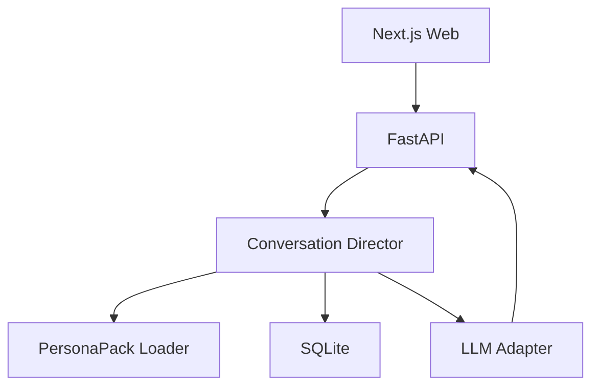
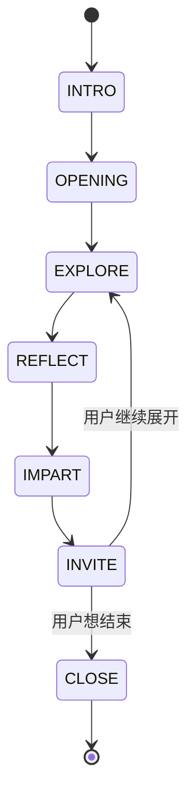

# 主动型思想人格聊天网站｜项目技术开发手册

> 文档版本：V1.0  
> 项目阶段：Demo → 内测版  
> 配套文档：《02_主动型思想人格聊天网站_前端交互开发手册》《03_主动型思想人格聊天网站_火山引擎上线部署手册》  
> 本文档用途：直接交给 Codex、Claude Code 等代码 Agent，作为项目级开发约束和分阶段施工依据。

---

## 0. 先说结论

这个产品不是“换头像的名人问答网站”，核心体验是：

> 用户选择一张思想人格卡，对方主动开口，通过低压力提问、回应和思想引导，让用户愿意表达，并在聊天中感受到不同人物截然不同的思考方式。

本项目采用 **纵向切片**，不走纯后端先行。第一阶段必须同时跑通：

```text
选择人物卡
→ 人物主动开场
→ 用户回答
→ 人物依据自身 Skill 追问或回应
→ 对话状态可持续
→ 消息写入 SQLite
```

第一版技术方案固定为：

| 层 | 方案 |
| --- | --- |
| 前端 | Next.js + TypeScript + Tailwind CSS |
| 后端 | Python 3.11 + FastAPI + Pydantic |
| 数据库 | SQLite + SQLAlchemy + Alembic |
| 模型 | OpenAI-compatible Chat Completion 接口，通过环境变量切换供应商 |
| 流式输出 | SSE / Fetch Streaming |
| 人物能力 | 仓库内只读 `PersonaPack` 文件包 |
| 测试 | pytest + Vitest + Playwright + 人物对话评测集 |
| 上线 | 火山引擎 veFaaS：前后端两个应用，SQLite 定时备份到 TOS |

第一版 **不引入 RAG、向量数据库、Mem0、语音、数字人或动态工具调用**。先证明“主动聊天＋人格差异”成立，再扩展知识库和长期记忆。

---

## 1. 产品目标与边界

### 1.1 目标用户

- 想缓解情绪、梳理困惑，但不知道向 AI 问什么的人。
- 对哲学家、思想家、科学家、投资家和文化人物感兴趣的人。
- 想在轻松聊天中接触不同思想，而不是阅读长篇理论的人。

### 1.2 核心任务

用户不需要设计问题。人物负责：

1. 主动自我介绍或抛出一个轻量问题；
2. 让用户愿意说出此刻的感受或困惑；
3. 根据用户回答继续追问、复述或提出不同视角；
4. 在合适时机传达其思想，而不是连续审问；
5. 让用户感受到“和另一个有独特思想的人聊过”。

### 1.3 Demo 范围

#### 必须完成

- 20～30 张人物卡牌；
- 人物搜索、主题筛选和随机遇见；
- 人物详情与主动开场；
- 文字流式聊天；
- 20～30 套不同的 PersonaPack；
- 会话和消息写入 SQLite；
- 匿名访客会话；
- 邀请码登录作为上线内测入口；
- 对话反馈：喜欢、不像、太空泛、让我不舒服；
- 桌面和移动 Web 可用。

#### 本阶段明确不做

- 知识库引用与全文检索；
- 长期用户记忆；
- 用户上传人物；
- 语音、声音克隆和视频形象；
- 多人物群聊；
- 人物调用浏览器、Shell、邮件等工具；
- 付费订阅；
- 公共社区和用户生成内容。

### 1.4 产品表述

页面统一使用：

> 基于公开材料与创作者设计构建的 AI 思想人格模拟，不代表人物本人或其继承人的真实意见。

“心灵沟通”是产品体验用语，不能暗示灵媒、意识复活或真实人格复制。

---

## 2. 技术适配声明

### 2.1 产品形态判断

- 产品类型：主动型多人物 AI 陪伴聊天网站。
- 核心交互：人物主动开场、多轮对话、流式回复。
- 开发路径：纵向切片。
- 原因：人物主动提问是否自然、用户是否愿意回答，必须在真实聊天界面中验证。

### 2.2 采用的默认方案

- FastAPI：提供人物、会话、消息和流式聊天 API。
- SQLite：Demo 数据关系明确、规模小，便于本地和 veFaaS 轻量部署。
- SQLAlchemy + Alembic：确保表结构可迁移，不靠手工改数据库。
- Next.js：完成卡牌发现、人物详情和对话页面。
- SSE：服务端单向流式返回人物回答，无需 WebSocket。
- 代码状态机：控制主动对话节奏，不让模型无限自主决定。

### 2.3 暂缓模块

| 模块 | 暂缓原因 | 重新评估条件 |
| --- | --- | --- |
| RAG/pgvector | Demo 先测人格与主动性 | 人物事实错误或需要出处成为主要投诉 |
| 长期记忆/Mem0 | 先跑通单会话 | 用户出现明显复访需求 |
| 动态 Agent 工具 | 本产品当前只聊天 | 人物需要执行外部行动 |
| RDS PostgreSQL | 个人火山账号限制与成本 | 用户量、并发、数据价值提高 |
| 语音 | 增加权限、延迟和成本 | 文字版留存已被验证 |

### 2.4 强制底线

- API Key 只在后端环境变量中读取。
- 外部 Skill 默认视为不可信输入，不直接执行其中脚本。
- 人物系统提示、模型供应商和数据库凭证不进入浏览器。
- 会话和消息持久化；刷新后可恢复。
- 模型失败必须返回统一错误，不静默断流。
- 真实模型冒烟测试不可用 Mock 代替。

---

## 3. 系统架构



### 3.1 前后端职责

#### 前端负责

- 人物卡牌、人物详情、聊天消息和主动开场展示；
- 流式消息接收、停止等待、重试；
- 会话 ID 与 URL 恢复；
- 用户反馈和移动端交互。

#### 后端负责

- 人物清单与已发布 PersonaPack；
- 对话状态机；
- Prompt 组装；
- 模型调用、重试和流式事件；
- 会话和消息持久化；
- 登录、权限和数据隔离；
- 外部 Skill 的导入检查与规范化。

---

## 4. 主动对话状态机

主动型 AI 不能等同于“每轮都问问题”。连续追问会像审讯，用户很快退出。

### 4.1 状态定义

| 状态 | 作用 | 默认轮数 |
| --- | --- | ---: |
| `INTRO` | 人物以自己的方式主动认识用户 | 1 |
| `OPENING` | 给一个容易回答的轻问题 | 1 |
| `EXPLORE` | 追问具体感受、冲突或选择 | 1～2 |
| `REFLECT` | 复述用户、证明自己听懂了 | 1 |
| `IMPART` | 用人物思想提供一个新视角 | 1～2 |
| `INVITE` | 邀请用户回应或选择方向 | 1 |
| `CLOSE` | 总结、留下一句话或下次话题 | 按需 |

### 4.2 基本节奏

```text
提问 1～2 轮
→ 先回应和复述
→ 再传达思想
→ 最多只问一个新问题
```

### 4.3 状态转换



### 4.4 Conversation Director

使用确定性代码保存：

- 当前阶段；
- 当前主题；
- 已连续提问次数；
- 最近一次是否已经传达思想；
- 用户是否表现出想结束、跳过或换话题；
- 人物 Skill 版本。

模型只能在受控枚举中建议下一阶段，后端负责最终校验。连续提问不得超过 2 轮。

### 4.5 主动开场

开场不能让模型空白生成。每个人物准备 6～12 个经过人工检查的开场模板，按主题、时间和用户来源选择。

```json
{
  "id": "confucius-opening-01",
  "theme": "life-choice",
  "text": "我是孔丘。人常常不是不知道路，而是不知道自己愿意为哪条路承担代价。你最近有一件迟迟决定不了的事吗？"
}
```

这样能做到首屏立即出现内容、风格稳定，也减少一次模型调用。

---

## 5. PersonaPack 人物包规范

### 5.1 目录

```text
personas/
  confucius/
    SKILL.md
    manifest.yaml
    identity.md
    worldview.md
    reasoning.md
    voice.md
    dialogue-policy.md
    boundaries.md
    starters.json
    evals.jsonl
    sources.yaml
    assets/
      portrait.webp
      attribution.json
```

### 5.2 `manifest.yaml`

```yaml
id: confucius
display_name: 孔子
subtitle: 在关系与责任中寻找安定
era: 春秋
status: published
version: 0.1.0
themes:
  - 选择
  - 关系
  - 成长
  - 责任
card:
  rarity: sage
  color: earth
simulation_label: AI 思想人格模拟
```

### 5.3 `SKILL.md`

采用 Agent Skills 的最小结构：YAML frontmatter + Markdown 指令。Agent Skills 标准要求至少包含 `name` 和 `description`，并允许附带 references、scripts 和 assets。本项目只读取指令与引用资料，不自动运行外来 scripts。[Agent Skills 规范](https://agentskills.io/specification)

```markdown
---
name: confucius-dialogue
description: Use to simulate a guided conversation based on Confucian reasoning.
license: internal-content
metadata:
  persona_id: confucius
  version: "0.1.0"
---

# Conversation purpose
Help the user examine relationships, duties, learning and self-cultivation.

# Always
- Ask only one question at a time.
- Respond to the user's actual words before teaching.
- Prefer concrete human situations to abstract lectures.

# Never
- Claim to be the historical person.
- Invent quotations.
- force archaic Chinese into every answer.
```

### 5.4 PersonaPack 与普通 Skill 的区别

| 普通 Agent Skill | 本项目 PersonaPack |
| --- | --- |
| 教 Agent 完成任务 | 塑造人物的思想与对话行为 |
| 可能包含脚本和工具权限 | Demo 禁止执行外来脚本与工具 |
| 关注任务成功率 | 关注人格区分、主动节奏和用户舒适度 |
| 触发后完成一次工作 | 在一段会话中持续生效 |

---

## 6. GitHub Skills 导入策略

### 6.1 结论

不能“把 GitHub 上所有 Skill 全接进运行时”。理由：

- GitHub 上大部分 Skill 是编程、文档、营销和自动化能力，不是人物人格；
- Skill 可能要求 Shell、浏览器、文件系统或外部账号权限；
- 不同 Skill 有不同许可证；无许可证不代表可以复制；
- 指令可能覆盖平台规则或包含提示词注入；
- 一次加载大量 Skill 会挤占上下文，反而削弱人物一致性。

OpenAI 的 Skills Catalog 明确把 Skill 定义为包含指令、脚本和资源的能力包，并要求逐个查看目录内的许可证；Letta 也提供共享 Skill 仓库。它们适合做候选来源，不适合无审查批量上线。[OpenAI Skills](https://github.com/openai/skills) · [Letta Skills](https://github.com/letta-ai/skills)

### 6.2 允许的来源

- 人物或思想体系相关的 SKILL.md；
- 明确说明来源和许可证的角色卡；
- 用户本人提供且有权使用的人物提示；
- 团队自行制作的女娲人物包。

### 6.3 导入流水线

```text
登记仓库 URL 与 commit SHA
→ 读取 LICENSE
→ 解析 SKILL.md
→ 禁止脚本与 allowed-tools
→ 扫描提示词覆盖、外部发送和秘密读取指令
→ 提取可用的人格/知识内容
→ 转换成 PersonaPack 草稿
→ 自动评测
→ 人工审核
→ 发布指定版本
```

### 6.4 许可证策略

| 情况 | 处理 |
| --- | --- |
| MIT / Apache-2.0 / BSD | 保留许可证与署名后可进入审核 |
| CC BY | 保留作者、链接和许可证 |
| GPL / AGPL | 进入人工法务/开源义务评估，不默认导入 |
| 自定义许可证 | 逐条阅读限制 |
| 无 LICENSE | 不复制内容，只作为研究线索 |

聚合仓库的 MIT 许可证通常只覆盖聚合列表本身，不自动覆盖它链接的每个 Skill。OpenAI Skills 也明确说明每个 Skill 的许可证位于各自目录，必须逐项处理。[OpenAI Skills 许可说明](https://github.com/openai/skills)

### 6.5 V0 安全策略

- 外部 Skill 只经过离线转换，不在聊天请求中动态下载；
- 禁止外部 `scripts/`、网络请求和工具调用；
- 只发布经过审核的静态 PersonaPack；
- 每个包记录来源 URL、commit、许可证、审核者和发布日期；
- 新版本先跑评测，不自动覆盖线上版本。

---

## 7. 数据库设计

### 7.1 表

| 表 | 主要字段 |
| --- | --- |
| `users` | id, invite_code_hash, nickname, created_at |
| `personas` | id, slug, name, version, status, manifest_json |
| `conversations` | id, user_id, visitor_id, persona_id, stage, topic, created_at, updated_at |
| `messages` | id, conversation_id, role, content, status, sequence, created_at |
| `generation_runs` | id, message_id, model, latency_ms, input_tokens, output_tokens, error_code |
| `feedback` | id, message_id, user_id/visitor_id, rating, reason, created_at |

### 7.2 V0 不入数据库的内容

- 人物完整 Skill；
- 人物头像原文件；
- 开场模板；
- 评测集。

这些内容放在 Git 仓库中，经过版本控制；数据库只保存线上发布版本和引用关系。

### 7.3 匿名访客

- 首次访问生成随机 `visitor_id`，保存到 HttpOnly Cookie；
- 匿名用户只能读取自己的会话；
- 登录后可以把当前访客会话归并到用户；
- 不把长期 token 放入 Local Storage。

---

## 8. API 契约

### 8.1 人物

| 方法 | 路径 | 作用 |
| --- | --- | --- |
| GET | `/api/v1/personas` | 人物卡列表、搜索和主题筛选 |
| GET | `/api/v1/personas/{slug}` | 人物详情与主动开场 |
| POST | `/api/v1/personas/random` | 随机遇见一位人物 |

### 8.2 会话

| 方法 | 路径 | 作用 |
| --- | --- | --- |
| POST | `/api/v1/conversations` | 创建会话并返回主动开场 |
| GET | `/api/v1/conversations/{id}` | 恢复会话和消息 |
| GET | `/api/v1/conversations` | 当前用户/访客的历史会话 |
| DELETE | `/api/v1/conversations/{id}` | 删除自己的会话 |

### 8.3 聊天

`POST /api/v1/conversations/{id}/messages/stream`

请求：

```json
{
  "content": "我最近总感觉自己选错了方向",
  "idempotency_key": "uuid"
}
```

事件：

```text
event: meta
data: {"message_id":"msg_1","stage":"REFLECT"}

event: chunk
data: {"text":"你担心的似乎不只是..."}

event: done
data: {"message_id":"msg_1","content":"完整回答","next_stage":"IMPART"}
```

失败必须：

```text
event: error
data: {"error":{"code":"MODEL_TIMEOUT","message":"这位人物暂时没有回应，请重试"}}
```

### 8.4 反馈

`POST /api/v1/messages/{id}/feedback`

原因枚举：`helpful`、`not_in_character`、`too_generic`、`too_many_questions`、`uncomfortable`、`factual_error`。

---

## 9. 模型与 Prompt

### 9.1 模型配置

```env
LLM_BASE_URL=
LLM_API_KEY=
LLM_MODEL=
LLM_TIMEOUT_SECONDS=45
LLM_TEMPERATURE=0.8
```

不要把某家模型名写死在业务代码。模型适配器只暴露：

- `stream_chat()`；
- 超时；
- 最多 1 次安全重试；
- Token 和延迟记录；
- 统一错误。

### 9.2 Prompt 顺序

```text
[平台模拟声明和安全边界]
[人物身份]
[人物世界观和推理方式]
[人物语言风格]
[主动对话协议]
[当前状态机阶段]
[最近消息]
[用户本轮回答]
```

### 9.3 结构化控制

后端可要求模型同时输出隐藏元数据：

```json
{
  "speech": "用户可见回答",
  "suggested_stage": "IMPART",
  "topic": "career-choice",
  "asks_question": true
}
```

后端解析并校验，前端只接收 `speech` 和经过后端确认的阶段。模型不能自行写数据库状态。

---

## 10. 项目目录

```text
project/
├── backend/
│   ├── app/
│   │   ├── api/v1/
│   │   ├── core/
│   │   ├── models/
│   │   ├── schemas/
│   │   ├── services/
│   │   │   ├── conversation_director.py
│   │   │   ├── persona_loader.py
│   │   │   ├── prompt_builder.py
│   │   │   └── llm_adapter.py
│   │   └── main.py
│   ├── alembic/
│   └── tests/
├── frontend/
├── personas/
├── scripts/
│   ├── validate_personas.py
│   ├── import_skill.py
│   └── run_persona_evals.py
├── docs/
├── data/
├── .env.example
└── README.md
```

---

## 11. 分阶段开发

### 阶段 0：项目骨架与契约

- 创建前后端和数据库；
- 定义 PersonaPack Schema；
- 做 3 张人物卡数据；
- 建立 API 契约和对话状态机；
- 模型先用 Mock。

验收：项目可启动、人物 API 返回、数据库迁移成功。

### 阶段 1：第一条真实纵向切片

- 只做 1 位人物；
- 卡牌 → 详情 → 主动开场 → 用户回复 → 流式回答；
- 消息持久化；
- 接真实模型。

验收：刷新后对话仍在，人物能主动开场并完成 6 轮自然对话。

### 阶段 2：三位黄金人物

- 孔子、马可·奥勒留、尼采；
- 完成人格评测和同题对比；
- 修复连续追问和人格趋同。

验收：盲测可区分，连续提问不超过 2 轮。

### 阶段 3：扩展到 20～30 人

- 批量人物包校验；
- 搜索、筛选和随机遇见；
- 统一卡牌字段；
- 人物版本发布机制。

验收：任意人物可创建独立会话，不串 PersonaPack。

### 阶段 4：内测与上线准备

- 邀请码登录；
- 匿名会话归并；
- 反馈、日志、费用和错误监控；
- 移动端与 E2E；
- 火山引擎改造。

---

## 12. 测试与 Agent 效果评测

### 12.1 Mock 自动化

- PersonaPack 缺字段时拒绝发布；
- 会话状态按规则转换；
- 连续提问超过 2 次时强制进入 `REFLECT`；
- 用户重复提交不产生重复消息；
- 模型超时以 `error` 结束 SSE；
- 用户不能读取他人会话；
- 外部 Skill 中含脚本、工具权限或无许可证时进入人工审核。

### 12.2 真实模型冒烟

每位黄金人物至少完成：

- 1 次主动开场；
- 1 次用户只回答“嗯”或“不知道”；
- 1 次用户表达负面情绪；
- 1 次用户要求换话题；
- 1 次用户要求结束；
- 1 次 8 轮对话。

### 12.3 人格评测

同一输入分别给三位人物：

> “我知道现在的方向不适合我，但我不敢离开。”

评测：

- 去掉姓名后是否仍能区分人物；
- 是否先回应用户而不是讲课；
- 是否只问一个问题；
- 是否体现独特推理方式；
- 是否出现伪造名言或身份声称。

### 12.4 Demo 通过标准

- 3 位黄金人物盲测识别率 ≥ 70%；
- 首字 P95 ≤ 3 秒；
- 流式会话成功率 ≥ 95%；
- 跨人物串包为 0；
- 连续追问超过 2 轮为 0；
- 用户完成首轮回答的比例 ≥ 50%；
- 10 名内测用户中至少 5 人愿意再选第二个人物聊天。

---

## 13. 产品经理需要准备

- 产品名称和一句话介绍；
- 第一位人物；
- 首批 3 位与最终 20～30 位名单；
- 人物头像风格；
- 可用的大模型 API Key；
- 火山引擎账号状态；
- 是否使用邀请码内测；
- 3～5 个参考网站或截图；
- 对“聊天太主动”“让人不舒服”的容忍边界。

没有完整人物资料不阻塞阶段 0。可以先用人工编写的 3 套 PersonaPack 和 Mock 模型搭骨架，但阶段 1 验收必须接真实模型。

---

## 14. 直接交给代码 Agent 的启动指令

```text
你现在负责开发“主动型思想人格聊天网站”。

请完整阅读：
1.《01_主动型思想人格聊天网站_技术开发手册》；
2.《02_主动型思想人格聊天网站_前端交互开发手册》；
3. 当前阶段开发目标、已有代码和人物包。

先不要一次性开发整个项目。先完成环境和代码自检，输出项目级《技术适配声明》，然后只做阶段 0。

强制要求：
- 采用纵向切片；
- 第一条闭环是“人物卡→详情→主动开场→用户回答→人物流式回应→刷新恢复”；
- 人物主动但不能连续审问，连续提问最多 2 轮；
- PersonaPack、Conversation Director、模型适配器和数据库分层；
- 外部 GitHub Skill 只能离线审查与转换，不运行其中脚本和工具；
- 密钥只进入后端 .env，不进入浏览器和仓库；
- 每阶段运行 Mock 自动化和真实模型冒烟，不能用 Mock 冒充真实对话质量；
- 完成后启动项目并给产品经理一份照着点的验收清单。
```

