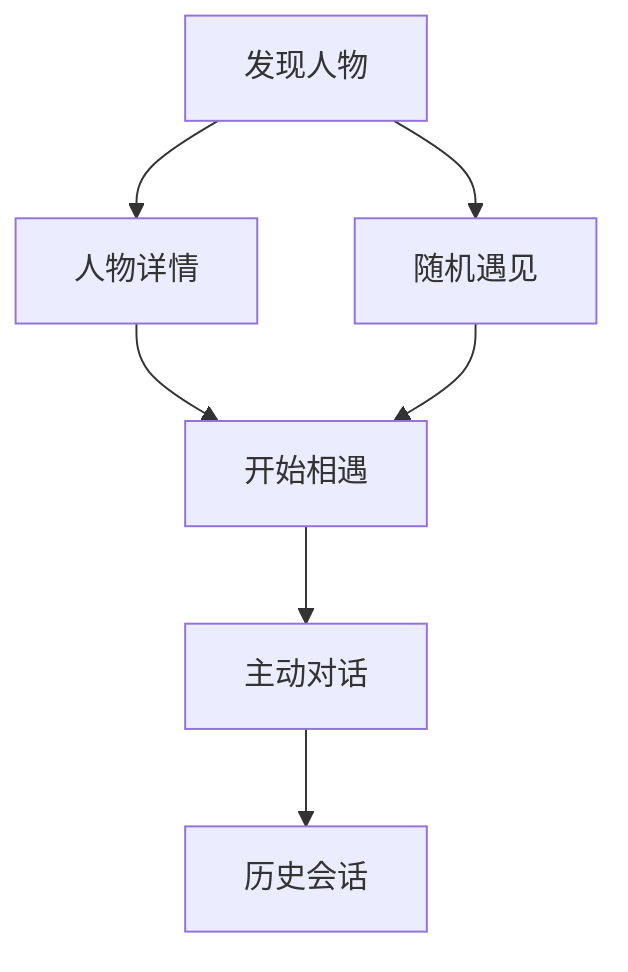

# 主动型思想人格聊天网站｜前端交互开发手册

> 文档版本：V1.0  
> 主要终端：桌面 Web，兼顾移动 Web  
> 配套文档：《01_主动型思想人格聊天网站_技术开发手册》  
> 核心原则：页面不是人物目录加聊天框，而是一场由人物主动发起的“相遇”。

---

## 0. 前端结论

前端必须围绕三个瞬间设计：

1. 用户看到一张卡，产生“我想认识他”的兴趣；
2. 用户进入后，不用想问题，对方已经主动开口；
3. 用户回答后，感受到对方真的听见了，并使用独特思想回应。

首版页面固定为：

```text
发现页
→ 人物详情与相遇页
→ 对话页
→ 历史会话页
→ 登录/内测页
```

产品不采用传统后台式左侧菜单，也不模仿通用 ChatGPT 界面。整体视觉方向是 **思想卡牌馆＋安静的沉浸式书房**。

---

## 1. 前端技术适配声明

### 1.1 项目判断

- 产品类型：主动型人格聊天与轻陪伴产品。
- 主要用户：不知道如何向 AI 提问，但愿意回应一个具体问题的人。
- 核心终端：桌面与移动浏览器。
- 开发方式：纵向切片，代表人物先行。

### 1.2 技术选择

| 项 | 选择 |
| --- | --- |
| 框架 | Next.js App Router + TypeScript strict |
| 样式 | Tailwind CSS + CSS 语义变量 |
| 组件 | shadcn/ui/Radix 基础交互 + 自建品牌组件 |
| 图标 | Lucide |
| 聊天基础 | assistant-ui 或等价流式 primitives，不采用其默认视觉 |
| 动效 | CSS Transitions；少量 Framer Motion 按需引入 |
| 请求 | 统一 API Client + Fetch Streaming |
| 状态 | URL + React State；服务端数据变复杂后再引入 TanStack Query |
| 测试 | Vitest + React Testing Library + Playwright |

### 1.3 偏离通用聊天产品

- 人物先说第一句话，输入框不是首屏视觉中心；
- 人物详情与首次聊天在同一条体验链上；
- 卡牌承担发现和趣味性，不只是头像列表；
- 不展示内部思维过程、Prompt 或技术日志；
- 不用“AI 正在思考”，改用人物化但不欺骗的状态文案。

---

## 2. 体验原则

### 2.1 主动，不审问

- 每条人物消息最多出现一个问号。
- 用户可以点“我不知道怎么说”“换个轻松的话题”“先听你说”。
- 人物连续问两轮后，下一轮必须先回应、反思或分享观点。
- 用户输入极短时，不用连续逼问具体细节。

### 2.2 有趣，不轻浮

- 卡牌有主题色、象征物和稀有度式视觉，但不做抽卡付费暗示。
- 进入人物时可以有一次短促“翻牌/揭幕”动效。
- 对话页保持克制，避免金币、经验条和连续签到破坏情绪安全。

### 2.3 像人物，不冒充人物

- 固定显示“AI 思想人格模拟”。
- 头像和姓名可以突出，但人物消息旁不显示“本人认证”等误导标识。
- 现代问题的推演可显示小标签“基于其思想的推演”。

### 2.4 低启动成本

用户首次进入对话前最多做一个选择：选人物或点“随机遇见”。不要求填写个人资料、兴趣和长问卷。

---

## 3. 信息架构



### 3.1 路由

| 路由 | 页面 |
| --- | --- |
| `/` | 发现页 |
| `/personas/[slug]` | 人物详情与开始相遇 |
| `/chat/[conversationId]` | 对话页 |
| `/history` | 历史会话 |
| `/enter` | 邀请码登录 |
| `/about` | 产品与 AI 模拟说明 |

---

## 4. 发现页

### 4.1 页面目标

让用户在 10 秒内完成“我想和谁聊”的选择。

### 4.2 首屏结构

```text
Logo / 产品名                         我的谈话

今晚，你想遇见谁？
有些问题，不必先想好怎么问。

[搜索人物或输入此刻的心情________________]

[随机遇见一位]

主题：全部 / 迷茫 / 关系 / 孤独 / 成长 / 财富 / 创造
```

### 4.3 卡牌内容

每张卡只展示：

- 人物肖像；
- 姓名；
- 一句角色定位；
- 3 个主题标签；
- 一句人物化邀请；
- `认识他`按钮。

示例：

```text
孔子
在关系与责任中寻找安定
选择 · 关系 · 成长

“你最近有一件迟迟决定不了的事吗？”
```

### 4.4 卡牌交互

- 桌面端悬停：头像轻微抬升，背面露出一条开场问题；
- 移动端点击：先展开信息，再点击“和他谈谈”；
- 焦点状态与悬停视觉等价；
- 动效尊重 `prefers-reduced-motion`；
- 图片失败时使用姓名首字和主题色，不出现破图。

### 4.5 搜索

支持两种输入：

- 人物名：“尼采”；
- 心情或场景：“我最近不知道要不要辞职”。

V0 场景匹配使用人物标签和关键词，不调用模型，避免搜索一次就产生模型费用。

### 4.6 随机遇见

随机按钮不是完全随机：

- 默认排除用户刚聊过的人物；
- 优先选择已发布、开场模板完整的人物；
- 结果页说明“为什么是他”，增强趣味和可信感。

---

## 5. 人物详情与相遇页

### 5.1 桌面布局

左侧 45%：大幅人物肖像、姓名、年代、标签。  
右侧 55%：人物介绍、适合谈什么、主动开场预览与开始按钮。

### 5.2 内容层级

1. 姓名与一句定位；
2. 100～180 字介绍；
3. “你可以和他谈”；
4. 3 个代表性问题；
5. “他可能会怎样与你谈”；
6. AI 模拟说明；
7. `开始相遇`。

### 5.3 进入对话

点击后：

1. 卡牌短暂翻面；
2. 创建会话；
3. 跳转 `/chat/{id}`；
4. 立即显示预制开场；
5. 输入框获得焦点但不自动弹出移动端键盘。

如果创建失败，停留在当前页并保留按钮，显示可重试提示。

---

## 6. 对话页

### 6.1 桌面结构

| 区域 | 内容 |
| --- | --- |
| 顶部 | 返回、人物小头像、姓名、模拟标签、更多菜单 |
| 主体 | 居中消息流，最大宽度 760px |
| 底部 | 快捷回应、文本输入、发送 |
| 右侧可选抽屉 | 人物简介、当前话题、反馈入口 |

### 6.2 移动端结构

- 顶部固定但高度不超过 56px；
- 消息流占满剩余空间；
- 快捷回应可横向滚动；
- 输入区跟随安全区域和软键盘；
- 右侧内容改为底部抽屉。

### 6.3 主动开场

开场消息直接存在于后端创建会话响应中，前端不能自己拼一段假消息。

首条消息下方给三个低压力回应：

- `我愿意说说`
- `我不知道怎么说`
- `先讲讲你自己`

快捷回应作为真实用户消息写入会话，不只改变前端状态。

### 6.4 消息样式

人物消息：

- 左对齐；
- 不使用传统彩色气泡；
- 人物名只在连续消息第一条显示；
- 正文具有较舒适行高；
- 提问句可轻微强调，不用大号加粗。

用户消息：

- 右侧浅色气泡；
- 不显示“我”头像；
- 失败时保留文字并提供重新发送。

### 6.5 流式状态

状态文案根据后端阶段显示：

| 阶段 | 文案示例 |
| --- | --- |
| `REFLECT` | 正在理解你刚才说的事… |
| `IMPART` | 正在从自己的经验中组织回应… |
| 普通生成 | 正在回应… |

这些文案只能表示可观察的生成阶段，不声称展示模型隐藏思维。

### 6.6 用户控制

每轮回答后提供轻量操作：

- 喜欢；
- 不太像他；
- 太空泛；
- 换个话题；
- 结束这次谈话。

更多菜单：清空本次会话、查看人物、举报不适内容。

### 6.7 重新回答

只在生成失败或用户主动打开菜单时出现，不把聊天变成 Prompt 调参台。

选项：

- 说得更简单；
- 少问我，多谈谈你的看法；
- 换一个角度；
- 重新回应。

---

## 7. 对话页面状态矩阵

| 状态 | 用户看到什么 | 可操作 |
| --- | --- | --- |
| `loading` | 骨架和人物色彩 | 返回 |
| `opening_ready` | 人物主动开场 | 快捷回应或输入 |
| `submitting` | 用户消息已发送、按钮禁用 | 停止等待 |
| `streaming` | 人物回答逐段出现 | 停止等待、向上查看 |
| `succeeded` | 完整回答和反馈操作 | 回答、换话题、结束 |
| `failed` | 失败原因，用户输入仍在 | 重试、复制、返回 |
| `disconnected` | 连接中断，说明任务未必停止 | 查询状态、重新连接 |
| `ended` | 一句收尾与本次主题 | 再聊一次、换个人物 |
| `not_found` | 会话不存在或已删除 | 回发现页 |
| `forbidden` | 当前账号无权查看 | 重新登录 |

不能在会话仍加载时显示“暂无消息”。

---

## 8. 输入与快捷回应

### 8.1 输入框

- 默认一行，最高扩到 6 行；
- Enter 发送，Shift+Enter 换行；
- 移动端提供明确发送按钮；
- 发送中防重复；
- 失败后输入不丢失；
- 不支持 HTML；
- V0 单条最多 2000 字。

### 8.2 快捷回应生成

V0 使用产品预设的通用选项＋当前状态模板，不额外调用模型。

```text
OPENING：我愿意说说 / 我不知道怎么说 / 先讲讲你自己
EXPLORE：是的 / 不完全是 / 我想换个话题
IMPART：这让我想到一件事 / 能说得更具体吗 / 我不太认同
```

### 8.3 空回答

如果用户只发“嗯”“不知道”：

- 不弹输入错误；
- 人物应降低提问压力；
- 给出一个二选一或分享自身视角；
- 不连续要求用户“详细说说”。

---

## 9. 历史会话页

### 9.1 列表项

- 人物头像和姓名；
- 首次对话主题；
- 最后一条消息摘要；
- 更新时间；
- `继续谈话`。

### 9.2 分组

- 今天；
- 最近 7 天；
- 更早。

### 9.3 空状态

> 你还没有遇见任何人。挑一张卡，让对方先开口。

按钮：`去遇见一个人`。

---

## 10. 视觉系统

### 10.1 风格关键词

思想卡牌、藏书室、博物馆、温暖纸张、克制、微神秘。

避免：赛博朋克、霓虹紫、科技蓝大渐变、游戏抽卡爆光、聊天软件高饱和气泡。

### 10.2 设计变量

```css
:root {
  --bg: #f3efe7;
  --surface: #fbf8f2;
  --surface-strong: #ffffff;
  --text: #25231f;
  --text-muted: #777166;
  --border: #d9d1c3;
  --accent: #7b5c3e;
  --danger: #b94a48;
  --success: #4f7458;
  --radius-card: 20px;
  --radius-control: 12px;
  --shadow-card: 0 18px 50px rgba(52, 44, 33, 0.12);
}
```

每个人物只有一个辅助主题色，不能重写整套全局设计变量。

### 10.3 字体

- 中文正文：系统字体 `PingFang SC / Microsoft YaHei / Noto Sans CJK SC`；
- 人物名和标题：可使用一款明确可商用的中文衬线字体；
- 英文数字：Inter 或系统字体；
- 不打包许可证不明的商业字体。

### 10.4 卡牌比例

- 桌面卡牌约 3:4；
- 移动端允许横向 4:3 紧凑卡；
- 肖像资源统一裁切区域和安全边距；
- 图片使用 WebP/AVIF 并准备低清占位。

---

## 11. 组件清单

### 基础组件

`Button`、`IconButton`、`Input`、`Textarea`、`Dialog`、`Drawer`、`Tooltip`、`Tabs`、`Tag`、`Skeleton`、`ErrorNotice`。

### 业务组件

| 组件 | 作用 |
| --- | --- |
| `PersonaCard` | 人物卡牌 |
| `PersonaGrid` | 卡牌布局、加载和空状态 |
| `PersonaHero` | 详情页人物区域 |
| `OpeningPrompt` | 主动开场与快捷回应 |
| `ConversationThread` | 消息流 |
| `PersonaMessage` | 人物消息与流式状态 |
| `UserMessage` | 用户消息与重发 |
| `QuickReplies` | 低压力快捷回应 |
| `ConversationComposer` | 输入与发送 |
| `MessageFeedback` | 人格与舒适度反馈 |
| `ConversationEnded` | 收尾和下一步 |

页面不能直接散落 `fetch`；所有接口进入 `features/*/api` 和统一客户端。

---

## 12. 前端目录

```text
frontend/
├── app/
│   ├── page.tsx
│   ├── personas/[slug]/page.tsx
│   ├── chat/[conversationId]/page.tsx
│   ├── history/page.tsx
│   ├── enter/page.tsx
│   ├── error.tsx
│   └── loading.tsx
├── components/
│   ├── ui/
│   └── layout/
├── features/
│   ├── personas/
│   ├── conversation/
│   ├── feedback/
│   └── auth/
├── lib/
│   ├── api/
│   ├── stream/
│   └── auth/
├── styles/
├── tests/
└── e2e/
```

---

## 13. API 与流式接入

### 13.1 同源代理

浏览器只访问 Next.js 的 `/api/*`，由 Next.js `rewrites` 或 Route Handler 转发到 FastAPI，避免 CORS 和浏览器暴露后端地址。

### 13.2 流式去重

- 每次用户发送生成 `idempotency_key`；
- `meta` 事件先返回 `message_id`；
- `chunk` 按序追加；
- `done` 用完整文本覆盖校正；
- 断线后先 GET 会话，不重新提交用户消息；
- 自动滚动只在用户仍位于底部时执行。

### 13.3 停止等待

V0 的按钮文案使用“停止等待”，仅中止浏览器连接。如果后端未来支持真正取消模型请求，再改为“停止生成”。

---

## 14. 响应式验收

最低检查：390px、768px、1280px、1440px。

### 移动端必须满足

- 不出现横向滚动；
- 卡牌和按钮触控区域不小于 44px；
- 软键盘弹起后仍能看到输入框和发送按钮；
- 底部抽屉可滚动且可关闭；
- 人物大图不会把主动开场挤出首屏太远；
- 历史会话可以单手继续进入。

---

## 15. 安全、隐私与舒适度

- Markdown 禁止危险 HTML；
- 外链使用安全属性；
- 前端不记录完整聊天内容到分析工具；
- 反馈只上传枚举和 message_id；
- 人物涉及自伤、医疗等高风险内容时，后端提供安全回应，前端清楚展示求助入口；
- “结束谈话”和“删除会话”随时可用；
- 删除必须确认，删除后列表立即同步。

---

## 16. 埋点

| 事件 | 含义 |
| --- | --- |
| `persona_card_viewed` | 看见人物卡 |
| `persona_detail_opened` | 打开详情 |
| `encounter_started` | 创建会话 |
| `opening_replied` | 回应人物第一问 |
| `message_sent` | 发送用户消息 |
| `conversation_six_turns_reached` | 达到 6 轮 |
| `persona_feedback_submitted` | 提交人格反馈 |
| `conversation_ended` | 主动结束 |
| `second_persona_started` | 开始与第二个人物谈话 |

首版核心漏斗：

```text
看见卡牌 → 打开人物 → 开始相遇 → 回答第一问 → 完成 6 轮 → 选择第二个人物
```

---

## 17. 分阶段前端开发

### 阶段 0：代表页

- 建立设计变量、布局和通用组件；
- 完成发现页＋3 张真实卡牌；
- 使用静态数据；
- 产品经理确认视觉方向后再扩展。

### 阶段 1：单人物真实闭环

- 人物详情；
- 创建会话；
- 主动开场；
- 用户回复；
- 流式回答；
- 刷新恢复。

### 阶段 2：多人物与发现

- 20～30 张卡；
- 搜索、主题和随机遇见；
- 人物详情统一模板；
- 历史会话。

### 阶段 3：质量与发布

- 邀请码登录；
- 错误、断线、空状态；
- 移动端；
- E2E、无障碍、性能、埋点和监控。

---

## 18. 测试与验收

### 自动检查

```bash
npm run lint
npm run typecheck
npm run test
npm run build
```

### Playwright 核心路径

1. 打开发现页；
2. 打开一张人物卡；
3. 创建会话并看到主动开场；
4. 点击“我不知道怎么说”；
5. 看到真实流式回应；
6. 刷新页面并恢复消息；
7. 结束谈话；
8. 从历史页继续进入。

### 产品经理照着点

- [ ] 不输入任何问题，也能自然开始聊天；
- [ ] 第一问容易回答，不需要先理解人物思想；
- [ ] 人物不会连续三轮只问问题；
- [ ] 三个人物从语言和思路上能区分；
- [ ] 用户说“不知道”时不会被继续逼问；
- [ ] 手机键盘不会挡住发送按钮；
- [ ] 流式失败后用户文字仍在；
- [ ] 刷新后历史消息仍在；
- [ ] 可以随时结束和删除谈话；
- [ ] 页面持续标明 AI 模拟。

---

## 19. 直接交给前端代码 Agent 的指令

```text
你现在负责“主动型思想人格聊天网站”的前端。

请先完整阅读：
1.《01_主动型思想人格聊天网站_技术开发手册》；
2.《02_主动型思想人格聊天网站_前端交互开发手册》；
3. 后端 OpenAPI/接口文档；
4. 当前代码和视觉参考。

先输出简洁的《前端技术适配声明》，然后只开发阶段 0 的代表页。视觉确认后再进入阶段 1。

强制要求：
- 核心体验是人物主动开口，不能把空输入框作为第一屏中心；
- 人物卡牌有趣，但聊天空间保持安静克制；
- 真实业务状态以后端为准；
- loading、empty、failed、streaming、disconnected、ended 分开设计；
- 不在前端暴露模型 Key、私密提示和后端地址；
- 每阶段启动真实浏览器，检查 390/768/1280/1440px；
- 运行 lint、typecheck、test、build，并至少跑一条真实后端 E2E；
- 完成后给产品经理一份照着点的验收清单。
```

