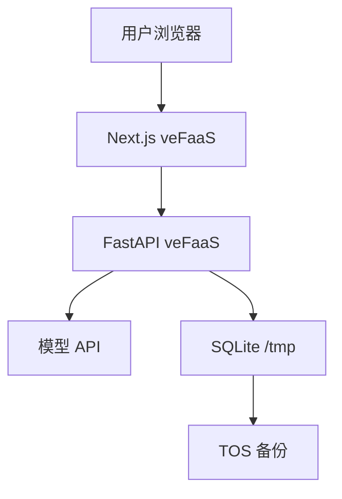

# 主动型思想人格聊天网站｜火山引擎上线部署手册

> 文档版本：V1.0  
> 部署目标：火山引擎 veFaaS 内测环境  
> 部署形态：FastAPI 后端应用＋Next.js 前端应用＋Serverless API 网关  
> 数据方案：SQLite `/tmp` 运行副本＋TOS 定时备份＋启动恢复  
> 使用前提：本地真实模型聊天、刷新恢复和邀请码登录已验收。

---

## 0. 上线结论

这个项目在火山引擎上部署为两个独立应用：



- 用户只访问前端 HTTPS 地址；
- 前端把 `/api/*` 同源代理到后端；
- 后端读取 PersonaPack、调用模型、保存会话；
- SQLite 活跃文件放在 `/tmp`；
- TOS 定时保存数据库备份和人物图片；
- veFaaS 设置至少 1 个预留实例，但仍不能把预留实例当成永久存储。

这个方案适合 10～100 名邀请用户的 Demo 和早期内测。出现以下任一条件时，应迁移 PostgreSQL：

- 多实例并发写入；
- 日活明显增长；
- 聊天记录具有不可丢失的业务价值；
- SQLite 锁冲突或备份恢复成为高频问题；
- 已具备企业实名认证和 RDS 使用条件。

---

## 1. 上线前置门槛

以下任一项不通过，不进入火山部署：

- [ ] 本地前端和后端能分别启动；
- [ ] 真实模型完成 8 轮对话；
- [ ] 主动开场由后端创建并持久化；
- [ ] 刷新对话页后消息仍在；
- [ ] 三位黄金人物不串 PersonaPack；
- [ ] 邀请码登录、错误邀请码和会话隔离已测试；
- [ ] 后端 pytest 通过；
- [ ] 前端 lint、typecheck、test、build 通过；
- [ ] `.env` 未进入 Git；
- [ ] 人物头像和外部 Skill 的许可证已登记；
- [ ] 已准备健康检查接口 `/api/v1/health`。

---

## 2. 产品经理需要准备

### 2.1 账号

- 火山引擎账号；
- 个人或企业实名认证；
- 可用的模型 API 账号；
- 可接收费用和异常通知的邮箱/手机号。

### 2.2 云服务

| 服务 | 用途 | 内测是否需要 |
| --- | --- | ---: |
| veFaaS | 跑前端和后端 | 必须 |
| Serverless API 网关 | 提供 HTTPS 地址 | 必须 |
| TOS | 数据库备份和图片 | 必须 |
| 日志服务 | 查询线上错误 | 建议 |
| Sentry | 应用异常通知 | 建议 |
| RDS PostgreSQL | 正式数据库 | 内测暂缓 |

### 2.3 必须由本人完成

- 登录和实名认证；
- 创建或授权子账号；
- 在控制台确认计费资源；
- 创建/撤销 AccessKey；
- 确认预算和费用告警；
- 分发邀请码。

密钥不要粘贴到文档、Issue、Git 提交或截图中。由部署执行者写入本地安全配置和 veFaaS Secret/环境变量。

---

## 3. 权限清单

子账号至少需要对应服务权限：

| 服务 | 用途 |
| --- | --- |
| veFaaS FullAccess | 创建、发布和缩放函数应用 |
| API 网关 FullAccess | 创建 Serverless 网关与路由 |
| TOS FullAccess | 创建桶、上传备份与人物资源 |
| 日志服务权限 | 查看运行日志 |
| 镜像仓库权限 | 仅在改用容器镜像部署时需要 |
| VPC/RDS 权限 | 仅在迁移云数据库时需要 |

权限遵循最小化原则。部署完成后可撤销临时高权限 AccessKey，日常更新使用权限更窄的部署身份。

---

## 4. 部署工具

部署前安装并更新火山引擎官方工具与部署 Skill。实际命令以部署当日 `vefaas --help` 和官方 Skill 为准，不依赖记忆中的旧参数。

```bash
npm i -g @volcengine/vefaas-cli
vefaas --version
vefaas skills update
vefaas login --check
vefaas doctor
```

如果尚未登录，由产品经理在安全环境中完成 AK/SK 配置。部署执行过程不得在终端日志或回复中回显完整密钥。

---

## 5. 项目部署改造

### 5.1 后端健康检查

```json
{
  "status": "ok",
  "version": "git-sha",
  "database": "reachable",
  "personas": 30
}
```

健康接口不得返回模型 Key、数据库路径、PersonaPack 内容和完整异常堆栈。

### 5.2 后端启动

FastAPI 监听 `0.0.0.0:8000`：

```bash
python -m uvicorn app.main:app --host 0.0.0.0 --port 8000
```

不要只写 `uvicorn`，避免线上 PATH 找不到命令。

### 5.3 前端 standalone

`next.config.ts`：

```ts
const nextConfig = {
  output: "standalone",
  async rewrites() {
    return [
      {
        source: "/api/:path*",
        destination: `${process.env.BACKEND_URL}/api/:path*`,
      },
    ];
  },
};

export default nextConfig;
```

构建后补齐静态资源：

```bash
npm run build
cp -r .next/static .next/standalone/.next/static
cp -r public .next/standalone/public
```

如果项目没有 `public/`，复制命令应允许跳过，不因此让构建失败。

启动：

```bash
node server.js
```

### 5.4 打包排除

后端 `.vefaasignore` 至少包含：

```text
.venv/
data/
__pycache__/
.pytest_cache/
.env
.git/
.vefaas/
tests/
```

前端排除本地缓存、测试报告和 `.env*`。部署前检查最终包中不存在密钥。

---

## 6. 线上环境变量

### 6.1 后端

```env
ENV=prod
APP_VERSION=<git-sha>
DATABASE_URL=sqlite:////tmp/data/persona-chat.db
PERSONA_DIR=/opt/application/personas

LLM_BASE_URL=<provider-base-url>
LLM_API_KEY=<secret>
LLM_MODEL=<model-name>
LLM_TIMEOUT_SECONDS=45

INVITE_CODES=<comma-separated-codes>
SESSION_SECRET=<random-secret>
COOKIE_SECURE=true
ALLOWED_FRONTEND_ORIGIN=<frontend-url>

STORAGE_PROVIDER=s3
S3_ENDPOINT=https://tos-s3-cn-beijing.volces.com
S3_ACCESS_KEY=<secret>
S3_SECRET_KEY=<secret>
S3_BUCKET=<bucket-name>
S3_REGION=cn-beijing

DB_BACKUP_KEY=db/persona-chat.db
DB_BACKUP_INTERVAL_SECONDS=300
SENTRY_DSN=<optional-secret>
```

`PERSONA_DIR` 的实际路径必须由部署包目录验证，不能盲目照抄。人物包是只读应用资产，可以随版本部署；会话数据库必须写入 `/tmp`。

### 6.2 前端

构建时：

```env
BACKEND_URL=<backend-https-url>
NEXT_PUBLIC_APP_VERSION=<git-sha>
```

不要设置：

```text
NEXT_PUBLIC_LLM_API_KEY
NEXT_PUBLIC_DATABASE_URL
NEXT_PUBLIC_SESSION_SECRET
```

`BACKEND_URL` 用于 Next.js rewrites，必须在构建时提供。部署后只修改运行时变量不能改变已经固化的代理目标。

---

## 7. 数据持久化

### 7.1 为什么 `/tmp` 仍会丢

veFaaS 实例的 `/tmp` 可写，但实例缩容、迁移或重建后可能消失。预留实例只能降低空闲回收概率，不能替代数据库和备份。

### 7.2 启动恢复

后端启动顺序：

```text
创建 /tmp/data
→ 检查本地 SQLite
→ 本地不存在时检查 TOS 备份
→ 有备份则下载到临时文件
→ 校验 SQLite 完整性
→ 原子移动为正式数据库
→ 执行 Alembic migration
→ 启动 API
```

下载或校验失败时，不得覆盖现有可用数据库。

### 7.3 定时备份

```text
暂停新备份任务
→ SQLite 在线备份到临时文件
→ PRAGMA integrity_check
→ 上传带时间戳版本
→ 更新 latest 指针/固定 key
→ 保留最近 N 个可恢复版本
```

不要直接上传正在写入的数据库文件。使用 SQLite backup API 或等价一致性快照。

### 7.4 恢复演练

上线前至少执行一次：

1. 创建测试用户和会话；
2. 手动触发备份；
3. 停止旧实例或在隔离环境删除本地副本；
4. 启动恢复；
5. 检查用户、会话和消息完整；
6. 记录恢复耗时。

未经恢复演练，不能声称“数据不会丢”。

### 7.5 SQLite 并发边界

- 内测后端保持单预留实例；
- 不随意增加后端实例数；
- 开启 WAL 需验证备份一致性；
- 写入使用短事务；
- 记录 `database is locked` 次数；
- 一旦需要多实例，迁移 PostgreSQL，不用对象存储同步多个 SQLite。

---

## 8. TOS 对象存储

TOS 保存：

- SQLite 备份；
- 人物肖像和署名元数据；
- 后续可能产生的可下载文件。

不保存：

- 明文 API Key；
- 未加密的环境变量文件；
- 无保留策略的完整敏感日志。

桶配置：

- 桶名使用小写字母、数字和连字符；
- 默认私有读写；
- 人物公开图片通过受控 CDN/签名或前端静态资源发布；
- 数据库备份路径禁止公开访问；
- 开启生命周期策略清理过旧备份。

TOS S3 兼容客户端按项目参考手册配置 `s3v4` 和 virtual addressing，并在真实环境执行上传、下载和权限拒绝测试。

---

## 9. 登录与数据隔离

### 9.1 内测登录

- 用户输入邀请码；
- 后端验证哈希，不在数据库保存邀请码明文；
- 成功后设置 HttpOnly、Secure、SameSite Cookie；
- 所有会话接口按用户或匿名 visitor_id 过滤；
- 访问他人会话返回 403；
- 管理接口使用单独身份，不复用普通邀请码。

### 9.2 匿名会话

如果内测允许未登录体验：

- 创建短期 visitor Cookie；
- 未登录最多保存限定数量的会话；
- 登录后经后端校验归并；
- 不允许通过猜 conversationId 访问他人数据。

### 9.3 会话删除

删除会话需要本人身份和明确确认。删除后数据库记录与后续备份需要遵守项目的删除策略，不能只从前端列表隐藏。

---

## 10. 部署顺序

### 10.1 创建网关

先查询是否已有 Serverless API 网关：

```bash
vefaas gateway list --first
```

没有则由产品经理在控制台创建：

- 地域与函数服务一致；
- Serverless 网关；
- 公网；
- 验证阶段关闭不需要的额外付费可观测选项；
- 创建任何计费资源前确认费用。

### 10.2 部署后端

先设置后端环境变量，再首次发布。首次发布不同时设置预留实例。

参考命令：

```bash
cd backend
vefaas inspect

vefaas deploy \
  --newApp persona-chat-api \
  --gatewayName <gateway-name> \
  --command "python -m uvicorn app.main:app --host 0.0.0.0 --port 8000" \
  --port 8000 \
  --yes
```

发布后：

1. 获取后端 HTTPS 地址；
2. 调用 `/api/v1/health`；
3. 设置最小预留实例为 1；
4. 测试创建会话和真实流式消息；
5. 测试 TOS 备份。

实际函数 ID、CLI 参数和命令需以部署时官方 Skill 为准。

### 10.3 部署前端

后端地址确认后再构建前端：

```bash
cd frontend
BACKEND_URL="https://<backend-url>" vefaas deploy \
  --newApp persona-chat-web \
  --gatewayName <gateway-name> \
  --buildCommand "npm run build && cp -r .next/static .next/standalone/.next/static && (test ! -d public || cp -r public .next/standalone/public)" \
  --outputPath ".next/standalone" \
  --command "node server.js" \
  --port 3000 \
  --yes
```

发布后前端地址是正式入口，后端地址不向普通用户展示。

### 10.4 发布判定

不能只看“网址打开”。还必须验证：

- 访问的是新版本；
- 静态资源无 404；
- `/api/*` 实际代理到后端；
- 邀请码登录成功；
- SSE 真正逐段返回，不是被网关缓存到最后一次性显示；
- Cookie 在 HTTPS 和代理链路中有效；
- 数据库写入和备份成功。

---

## 11. 上线验收

### 11.1 技术验收

- [ ] 前端 HTTPS 地址可访问；
- [ ] `/api/v1/health` 正常；
- [ ] 前端静态资源 200；
- [ ] 错误邀请码拒绝；
- [ ] 正确邀请码登录；
- [ ] 用户 A 不能读取用户 B 会话；
- [ ] 人物卡加载 20～30 人；
- [ ] 创建会话立即出现主动开场；
- [ ] 真实模型流式回复；
- [ ] 刷新后消息恢复；
- [ ] 数据库备份进入 TOS；
- [ ] 从 TOS 恢复演练通过；
- [ ] Sentry/日志可定位一次测试错误；
- [ ] 日志不存在密钥和完整敏感聊天内容。

### 11.2 产品验收

- [ ] 手机和电脑都能完成首轮聊天；
- [ ] 人物没有连续三轮只提问；
- [ ] 三位黄金人物明显不同；
- [ ] 生成失败后用户输入没有丢；
- [ ] 用户可结束和删除谈话；
- [ ] 页面持续标明 AI 模拟；
- [ ] 首次打开到人物主动开场不超过合理等待时间。

---

## 12. 日志与监控

每个请求生成 `trace_id`，记录：

- 路由；
- 用户/访客匿名 ID；
- conversation_id；
- persona_id 和版本；
- 模型名；
- 首字时间、总耗时、Token；
- SSE 是否正常 `done/error`；
- 错误码；
- 数据库锁错误；
- TOS 备份结果。

不记录：

- API Key；
- Cookie/邀请码；
- 完整用户消息；
- 完整人物系统 Prompt；
- TOS Secret。

至少设置告警：

- 5 分钟错误率显著上升；
- 模型连续超时；
- 备份连续失败；
- 数据库锁错误；
- 前端 5xx；
- Token 消耗超过预算阈值。

---

## 13. 费用控制

费用来源：

- 两个 veFaaS 应用；
- 后端预留实例；
- Serverless API 网关；
- TOS 存储和流量；
- 模型 Token；
- 日志和 Sentry 套餐。

内测阶段：

- 只保留后端必要的预留实例；
- 前端若可按需启动，则不强制常驻；
- 限制单条输入和最大输出 Token；
- 单会话设置最大轮数软提醒；
- 每个邀请码设置日调用上限；
- 创建预算告警；
- 不把失败请求无限重试。

创建或升级计费资源前，必须向产品经理说明费用类型、量级和停止方式。

---

## 14. 更新与回滚

### 14.1 更新顺序

1. 数据库迁移向后兼容；
2. 发布后端；
3. 验证旧前端仍可调用；
4. 用新后端地址构建前端；
5. 发布前端；
6. 跑完整冒烟。

### 14.2 PersonaPack 更新

- 人物包使用版本号；
- 新会话使用新版本；
- 旧会话默认保留创建时版本，避免中途人格突变；
- 发布前跑该人物评测；
- 能按 Git commit 回滚。

### 14.3 回滚

- 保留上一版可部署产物或 commit；
- Alembic 迁移标注能否降级；
- 破坏性迁移先备份；
- 前端回滚时确认 rewrites 指向仍可用后端；
- 回滚后重新验证登录、创建会话和流式聊天。

---

## 15. 常见问题

| 现象 | 可能原因 | 处理 |
| --- | --- | --- |
| `Read-only file system` | SQLite 写到应用目录 | 改为 `/tmp/data/*.db` |
| `uvicorn not found` | PATH 不含命令 | 使用 `python -m uvicorn` |
| 首次发布无法设预留实例 | 尚无已发布版本 | 先发布，再单独 scale |
| 前端能开但 `/api` 失败 | `BACKEND_URL` 构建时未注入 | 重新构建并发布前端 |
| SSE 最后一次性出现 | 网关/代理缓存 | 检查响应头与真实网关流式支持 |
| 登录后 Cookie 不生效 | Domain、Secure、SameSite 或代理问题 | 检查同源代理和 Set-Cookie |
| 聊天记录一段时间后消失 | 实例重建且无可用备份 | 检查预留实例、TOS 备份和启动恢复 |
| `database is locked` | 并发写入或多实例 | 缩短事务；达到边界就迁移 PostgreSQL |
| 人物头像 403 | 私有 TOS URL 直接给浏览器 | 使用签名 URL/CDN 或打包静态资源 |
| 人物更新后旧会话风格变化 | 未锁定 persona_version | 会话保存创建时版本 |

---

## 16. 直接交给部署 Agent 的指令

```text
请把“主动型思想人格聊天网站”部署到火山引擎 veFaaS。

先完整阅读：
1.《01_主动型思想人格聊天网站_技术开发手册》；
2.《02_主动型思想人格聊天网站_前端交互开发手册》；
3.《03_主动型思想人格聊天网站_火山引擎上线部署手册》；
4. 当前项目代码、README、迁移文件和测试结果。

先不要直接创建计费资源。先完成本地验收自检，并输出一份“上线方案摘要”：需要哪些服务、费用来自哪里、需要产品经理配合什么、数据如何恢复、最终得到哪两个地址。

强制要求：
- 部署当日先更新并完整阅读官方 veFaaS Skill，以实际 CLI 帮助为准；
- 前后端作为两个应用部署，用户只访问前端 HTTPS 地址；
- 后端密钥只进线上 Secret/环境变量；
- SQLite 运行副本只能写 `/tmp`，并实现 TOS 一致性备份、版本保留和启动恢复；
- 预留实例不等于永久存储，必须完成一次恢复演练；
- 前端 BACKEND_URL 在构建时注入；
- 先部署后端并验证，再构建和部署前端；
- 验证邀请码、用户隔离、流式输出、刷新恢复、人物版本和 TOS 备份；
- 创建任何计费资源前先说明并等待确认；
- 不回显 AK/SK、模型 Key、数据库秘密或完整聊天内容；
- 完成后给出前端访问地址、部署版本、已通过检查、已知问题和产品经理照着点的验收清单。
```

