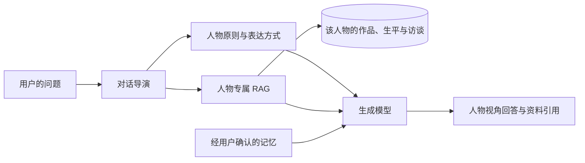

# 先贤心语

> 让散落在作品、生平、演讲与访谈中的思想，成为一段可以继续追问的对话。

**先贤心语**不是一个给通用大模型换名字、换头像的聊天网站。它尝试为每一位人物建立独立的资料空间、思想框架和表达方式，让回答尽量从这个人的经历、作品与哲学出发，而不是从一个千人一面的助手出发。

线上内测：https://s4rjvbvdqb1lgslonbgbq.apigateway-cn-beijing.volceapi.com/

当前版本采用邀请码登录，面向小规模内测。

## 我们为什么做它

一个人离开后，留下来的通常是分散的：几本书、一些演讲、书信、采访、旁人的回忆，以及后世对他的解释。资料可以被保存，却很难像一个完整的人那样被理解。

我们希望把这些材料重新组织成一个可探索的思想世界：你可以带着今天的困惑走进去，向孔子追问关系与责任，向马可·奥勒留询问可控与不可控，向尼采追问那些被默认接受的价值。系统不只复述一句名言，而是尽量沿着这个人物一贯的价值次序和推理路径，回应一个从未在原始资料中出现过的新问题。

这就是我们所说的“赛博永生”：不是宣称复制了一个人的意识，也不是伪造真人身份，而是让一个人的知识、思想和生命轨迹在数字世界中持续可被阅读、追问、检验和更新。

对于仍然在世的人物，我们希望未来能够持续纳入其公开发表的新作品、演讲和访谈，让人物知识库拥有可追溯的版本，随着真实公开资料动态成长。

## 它与普通角色聊天有什么不同

普通角色聊天往往依赖一段系统提示词。人物知道什么、如何思考、为什么得出这个判断，最终仍主要取决于通用模型。

先贤心语把人物拆成四个相互配合的部分：

1. **人物专属知识库**：每个人物拥有独立的 RAG 检索范围。人物 A 的资料不会作为人物 B 的检索依据。
2. **思想与表达模型**：人物包描述其核心原则、价值排序、常用推理方式、语言节奏和不能越过的边界。
3. **有出处的回答**：系统按当前问题召回相关原始片段，并在界面中展示可核验的资料来源。
4. **用户拥有的记忆**：只有用户明确选择“记住”，内容才会进入后续会话；人物关系可以连续，但记忆权仍属于用户。

底层大模型仍然具有预训练知识，因此“专属知识库”不是密码学意义上的知识隔离。当前实现通过人物级检索隔离、提示词边界和资料引用约束回答；当资料不足时，产品应表达不确定，而不是借人物之名编造经历或观点。

## 当前已经实现

- 19 位可对话人物，包含 4 个本地人物包与 15 个固定版本的上游人物 Skill。
- 每个人物独立的身份、原则、语言风格、对话策略与安全边界。
- 第一人称沉浸式对话，不在每一轮重复“AI 扮演”提示。
- Markdown 资料按标题与语义切分，使用 BM25 + 向量检索 + RRF 融合排序。
- 当前语料规模为 255 份资料、约 10,000 个知识分块；每轮只注入最相关的少量片段。
- 对话阶段管理、主动追问、快捷回复、停止生成与失败降级。
- 会话历史、语义识别的重要长期记忆，以及可编辑的心语札记。
- 心语札记可导出 Markdown、Word 或 PDF；完整对话可按需作为附录导出。
- 高风险心理信号在模型调用前中断人物表达，进入确定性安全响应。
- 一人一码的邀请制登录，可在不同设备恢复同一账号的数据。
- 火山引擎 veFaaS 部署，以及私有对象存储中的加密数据库快照与版本保留。

## 系统如何工作



一次对话的核心过程是：

1. 判断用户当前的意图、情绪和对话阶段。
2. 只在当前人物的知识空间中进行关键词与向量召回。
3. 将人物原则、表达方式、相关资料和已确认记忆组合成生成上下文。
4. 以人物第一人称回应，同时保留来源、事实与安全边界。

主要技术栈：

- 前端：Next.js 16、React 19、TypeScript
- 后端：FastAPI、SQLAlchemy、SQLite、Alembic
- 检索：BM25、FastEmbed、`BAAI/bge-small-zh-v1.5`、RRF
- 模型：OpenAI-compatible 流式接口，可接入火山方舟等兼容服务
- 部署：火山引擎 veFaaS、API Gateway、私有对象存储备份

## 下一阶段：女娲人物创建

“女娲”是计划中的人物蒸馏流程，目前尚未作为用户功能上线。

未来，用户可以上传自己熟悉人物的资料包，例如传记、文章、聊天记录、演讲、音视频转录与时间线。女娲流程将完成：

```text
资料上传
  → 格式解析与去重
  → 事实、时间线与来源校验
  → 价值观、语言习惯和思考方式蒸馏
  → 生成人物包与专属 RAG 知识库
  → 用户审核、修正和发布
  → 持续补充资料与版本更新
```

这个功能的关键不是“模仿得像”，而是让创建者始终知道：人物依据了哪些资料、哪些判断是推断、哪些部分仍然缺失。涉及真实个人时，还需要处理授权、隐私、删除权与公开范围。

## 路线图

- [x] V1：人物目录、人物详情与沉浸式对话
- [x] V1：人物级混合 RAG、引用、记忆与札记
- [x] V1：邀请码内测、火山引擎部署与数据备份
- [x] V1.1：重要记忆语义识别、真实编辑/暂停/删除与人物级隔离
- [x] V1.1：心语札记 Markdown、Word、PDF 导出与可选完整对话附录
- [ ] V1.2：进一步增强人物间的语言、价值排序与推理差异
- [ ] V1.2：人物资料版本、增量更新与来源审核后台
- [ ] V2：女娲资料上传、蒸馏、预览和人物创建工作流
- [ ] V2：在世人物公开资料的定期更新与版本对比
- [ ] V3：在授权和隐私机制下支持用户创建、分享与共同维护人物

## 本地开发

### 环境要求

- Node.js 20+
- npm 11+
- Python 3.11
- SQLite 3.35+，并支持 FTS5

### 安装

```bash
python3.11 -m venv backend/.venv
backend/.venv/bin/python -m pip install -e 'backend[dev]'

cd backend
.venv/bin/alembic upgrade head
.venv/bin/python -m app.scripts.seed
.venv/bin/python -m app.scripts.ingest_rag

cd ../frontend
npm ci
```

将根目录 `.env.example` 复制为 `.env` 后可以配置真实模型。本地默认可使用 Mock 模型跑通业务流程。不要把真实密钥、邀请码或数据库提交到 Git。

### 启动

后端：

```bash
cd backend
.venv/bin/python -m uvicorn app.main:app --host 127.0.0.1 --port 8765 --reload
```

前端：

```bash
cd frontend
npm run dev -- --hostname 127.0.0.1
```

打开 http://127.0.0.1:3000，后端健康检查位于 http://127.0.0.1:8765/health。

### 接入真实模型

```bash
LLM_PROVIDER=openai_compatible
LLM_API_KEY=your-local-secret
LLM_BASE_URL=https://your-provider.example/v1
LLM_MODEL=your-model-id
```

人物回复与对话意图识别可以使用不同模型。未配置、超时或返回格式异常时，意图识别会回退到本地规则，不阻断聊天和安全流程。

## 测试

```bash
cd backend
.venv/bin/ruff check app tests alembic/env.py
.venv/bin/mypy app tests
.venv/bin/pytest

cd ../frontend
npm run lint
npm run typecheck
npm test
npm run build
npm run test:e2e
```

Playwright 会在桌面和移动视口验证人物发现、对话、记忆、札记与安全恢复主流程。

## 目录结构

```text
backend/          FastAPI API、对话编排、RAG、认证、记忆与持久化
frontend/         Next.js 界面与端到端测试
personas/         本地人物包：身份、原则、风格、资料与开场
skills/           已审核并固定版本的上游人物 Skill
data/seed/        基础种子数据
docs/             产品、技术、模型选型与设计验证文档
```

## 数据、安全与人物边界

- 人物对话基于公开资料和模型生成，不等于真人本人、本人授权或真实意识复现。
- 在世人物不会被描述为本人实时发言，也不应生成未公开经历、私人信息或确定性的专业建议。
- 未审核的外部 Skill 不会执行；已纳入 Skill 固定到明确提交，运行时只读取允许的文本资料。
- 长期记忆必须由用户确认；密钥、邀请码、数据库与部署凭据均被排除在版本控制之外。
- 自伤、自杀等高风险信号优先进入平台安全流程，人物风格不能覆盖安全响应。

更完整的产品与实现记录位于 [`docs/`](docs/)。

---

我们想保存的，不只是一个人说过什么，而是他为什么会这样想。
