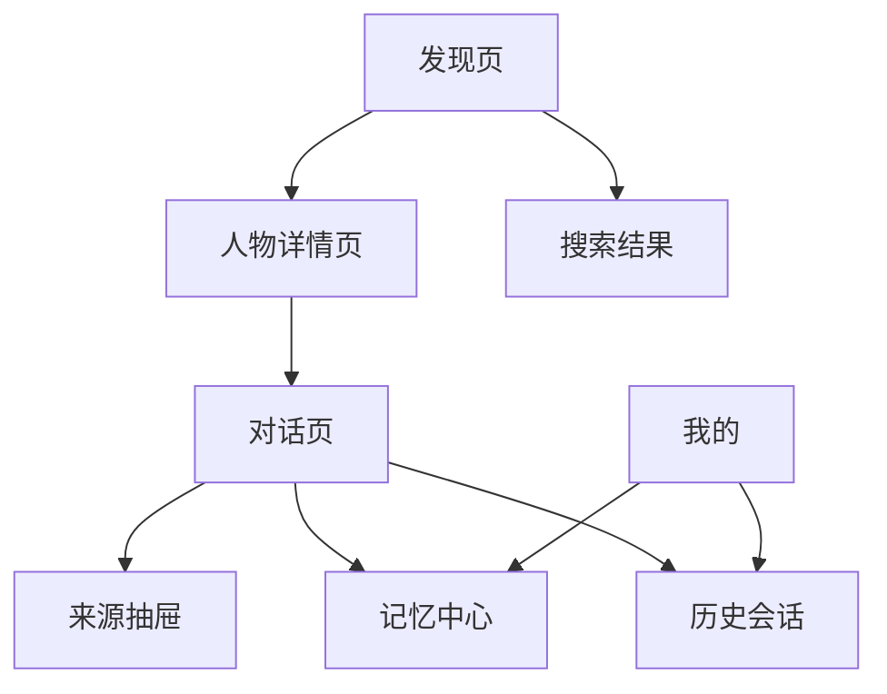
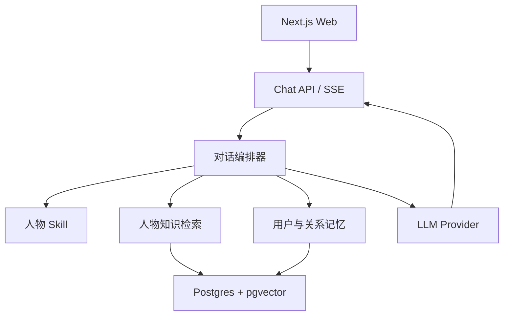
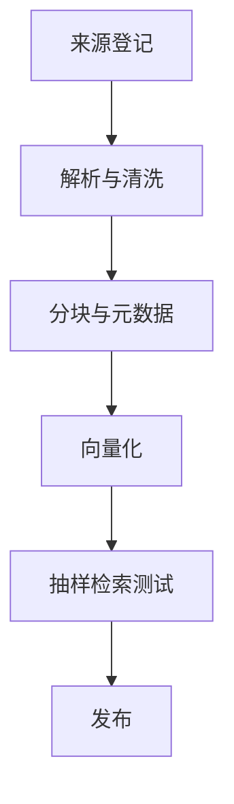

# 世界名人心灵对话网站 Spike 技术文档

> 文档版本：V0.1  
> 日期：2026-08-26  
> 项目代号：Spiritarium（暂定）  
> 产品形态：可与历史思想家、哲学家、科学家和投资家持续对话的 AI 人格陪伴网站

---

## 0. Spike 结论

这个产品在技术上可行，首版无需训练或微调模型。

推荐采用一套轻量的 Next.js 单体架构，围绕四个相互隔离的核心层搭建：

1. **人物 Skill**：决定人物怎样思考、怎样表达、哪些话不会说。
2. **人物知识库**：提供著作、演讲、书信和可靠传记中的事实依据。
3. **会话上下文**：维持当前一段对话的连贯性。
4. **用户长期记忆**：记住用户的经历、目标和与该人物共同讨论过的问题。

最重要的工程原则是：

> 人格负责“怎么回答”，知识库负责“依据什么回答”，记忆负责“为什么这次要这样回答”。

不要把三者混成一个超长 System Prompt。混在一起会导致上下文成本迅速膨胀、人物人格漂移、引用失真和记忆污染。

建议先做 **3 个高完成度人物的技术 Spike**，验证问答质量与记忆链路；随后利用“女娲人物工坊”批量扩展到 30 人。30 个只有头像和一段提示词的人物不会形成产品壁垒，6 个真正“聊得像、说得准、记得住”的人物更能验证需求。

---

## 1. 产品定义

### 1.1 一句话定位

用户可以找到一位自己敬仰的思想者，与其 AI 思想人格持续交谈，在真实著作和思想体系的约束下获得新的理解、陪伴和行动建议。

### 1.2 产品承诺

产品提供的是基于公开材料构建的 **AI 人格模拟**，不是本人、灵媒服务或真实意识复现。

首页、人物详情页和首次会话均应明确提示：

> 这是基于公开著作与历史资料构建的 AI 模拟，回答可能存在误差，不代表人物本人或其继承人的真实意见。

### 1.3 首版目标

- 用户能在 30 位人物中搜索和选择一人。
- 每位人物都有独立头像、介绍、思想标签、人物 Skill 和知识库。
- 用户能进行流式聊天，查看回答所依据的来源。
- 登录用户能保存会话。
- 系统能提取并保存可控的长期记忆。
- 用户再次进入时，人物能自然承接过去的讨论。
- 管理员能通过标准人物包新增和更新人物，无需修改业务代码。

### 1.4 首版不做

- 不做实时数字人口型、视频通话和口型同步。
- 不做名人声音克隆。
- 不开放用户自行创建公众人物。
- 不让人物执行转账、交易、医疗诊断等高风险操作。
- 不做多人物群聊。
- 不做复杂 Agent 工具调用。
- 不做模型微调。

这些能力会显著增加成本、延迟、审核和肖像/声音权风险，却不会帮助验证首要假设：用户是否愿意与“可信、稳定、记得自己”的思想人格持续交谈。

---

## 2. 首先需要验证的五个假设

| 假设 | Spike 验证方法 | 通过标准 |
| --- | --- | --- |
| 人格差异能被用户感知 | 同一个问题分别询问孔子、尼采、马可·奥勒留 | 盲测中 70% 以上用户能正确区分人物 |
| RAG 能降低胡编名言 | 建立 50 道带标准出处的问题集 | 引用支持率 ≥ 90%，虚构引语率 ≤ 3% |
| 记忆能提高复访体验 | 第二次会话注入经过授权的用户记忆 | 70% 测试用户认为承接“自然且不冒犯” |
| 30 人内容生产可规模化 | 用同一流水线制作 3 个差异很大的人物 | 单个人物人工制作时间控制在 4 小时内 |
| 用户愿意持续聊而非只尝鲜 | 观察首批种子用户 7 天行为 | 人均完成 3 次以上会话或 D7 ≥ 15% |

---

## 3. 前端信息架构与交互

### 3.1 页面结构



### 3.2 发现页 `/`

目标不是陈列 30 张同质头像，而是让用户快速找到“此刻最想聊的人”。

页面从上至下：

1. **顶部主命题**：`此刻，你想向谁请教？`
2. **自然语言搜索框**：支持输入人物名，也支持输入“我失恋了，想找一个人聊聊”。
3. **场景入口**：人生困惑、关系、事业、财富、孤独、创造、死亡、自由。
4. **人物推荐卡**：头像、姓名、年代、三个思想标签、适合谈什么。
5. **继续上次谈话**：登录且存在历史会话时置顶。

交互要求：

- 搜索“失恋”时，不只匹配人物名，应依据人物的 `topics` 和 `use_cases` 推荐人物。
- 卡片悬停时显示一句经过核验的代表性观点；移动端点击后展开。
- 不要在首页展示在线人数、虚假评分或伪造的“已有 10 万人对话”。

### 3.3 人物详情页 `/figures/[slug]`

页面要回答三个问题：他是谁、适合聊什么、AI 是依据什么塑造的。

建议模块：

- 大幅人物肖像与年代背景。
- 30～60 字人物定位。
- `适合和他聊`：4～6 个问题场景。
- 三条“开场提问”按钮。
- `思想来源`：核心著作和资料数量。
- `AI 模拟说明`与资料边界。
- 主按钮：`开始一场谈话`。

首次进入不要直接给用户一个空白输入框。系统应由人物先说一句与其性格相符、但不过度表演的开场白，并给出三个可点击问题。

### 3.4 对话页 `/chat/[conversationId]`

桌面端使用三栏结构：

| 区域 | 内容 |
| --- | --- |
| 左侧窄栏 | 返回、人物列表、历史会话、新建对话 |
| 中间主栏 | 消息流、引用标记、输入框 |
| 右侧抽屉 | 人物简介、相关记忆、本轮引用来源 |

移动端只保留消息主栏，左栏和右栏用抽屉打开。

#### 消息设计

- 人物回答采用流式输出。
- 回答末尾最多显示 2～4 个可点击来源编号。
- 直接引语必须带来源；无法确认原文时必须改为转述。
- 每条回答提供：有启发、没说到点上、查看依据、重新回答。
- `重新回答`可选择：更简洁、更深刻、更贴近原著、更具体可行。
- 输入框上方提供动态追问，而不是固定的“继续”。

#### 生成状态

不要只显示三个跳动圆点。可以显示可理解但不暴露模型隐私的阶段：

1. 正在回想与你有关的经历
2. 正在查找人物著作
3. 正在组织回答

#### 记忆交互

当系统识别到一个可能值得长期保存的事实，例如“用户正在准备转行做 AI 产品经理”，不要静默永久保存。消息下方显示轻提示：

> 要让以后与你交谈的人记住这件事吗？  `记住` `仅本次` `编辑`

设置中还需提供全局开关：`自动建议记忆`、`不保存任何长期记忆`。

### 3.5 记忆中心 `/memory`

记忆必须可见、可编辑、可删除，否则“陪伴”很容易变成“被监视”。

分成两类：

- **关于我的记忆**：职业、目标、偏好、重要经历。
- **我与某人物的共同记忆**：讨论过的主题、人物给过的建议、尚未完成的约定。

每条记忆显示来源会话、创建日期、最近使用时间和删除按钮。

### 3.6 留存机制

首版只做与核心价值一致的留存：

- 回到首页直接继续上一段对话。
- 人物记住用户未解决的问题，并在下一次自然询问进展。
- 每 5～8 次有实质内容的对话，自动生成一页“思想札记”。
- 用户可以收藏某段回答和引用来源。
- 可选的每周回顾：`这周你和三位思想者谈明白了什么`。

不要用签到金币、强制连续打卡等机制破坏严肃感。

---

## 4. 推荐技术架构



### 4.1 推荐技术栈

| 层 | 选择 | 原因 |
| --- | --- | --- |
| Web | Next.js App Router + TypeScript | 前后端同仓，适合快速 Demo 和 Vercel 部署 |
| UI | Tailwind CSS + shadcn/ui + assistant-ui | 快速得到成熟的流式聊天、滚动、重试和无障碍交互 |
| 流式生成 | Vercel AI SDK 或兼容的 SSE 封装 | 支持多模型与流式输出 |
| 数据库 | Supabase Postgres | 同时提供 Auth、数据库和对象存储 |
| 向量检索 | pgvector | 人物、会话、记忆都可留在同一数据库，减少基础设施 |
| ORM | Drizzle ORM | TypeScript 原生，支持 pgvector，迁移清晰 |
| 知识入库 | Node 脚本，必要时单独使用 Python 清洗 | 首版避免维护第二个在线后端 |
| 长期记忆 | V0 自建轻量记忆表；V1 可替换为 Mem0 | 先保证可控，再引入更复杂的自动记忆 |
| 部署 | Vercel + Supabase | 对个人 Demo 成本和运维压力最低 |
| 监控 | Sentry + 简单事件埋点 | 记录错误、延迟、引用点击和反馈 |

Supabase 官方给出了 Next.js、向量化和 pgvector 检索的完整路径；pgvector 可同时支持精确和近似向量检索，足够支撑 30 人的小规模知识库。[Supabase 向量搜索示例](https://supabase.com/docs/guides/ai/examples/nextjs-vector-search) · [pgvector](https://github.com/pgvector/pgvector)

### 4.2 为什么首版不采用 FastAPI 双后端

GitHub 上的历史人物 Demo 大多采用 React + FastAPI，这种结构清楚，但会增加跨域、部署和两套类型定义。你的首版没有耗时的 Python Agent 工作流，使用 Next.js Route Handler 即可。

当后续加入大规模文档清洗、离线评测或复杂图谱后，再把 `ingestion` 和 `evaluation` 拆成 Python Worker。

---

## 5. 单轮对话运行链路

用户发送消息后执行以下步骤：

1. 校验用户、会话和人物权限。
2. 读取人物 Skill 的已发布版本。
3. 读取最近 12～20 条消息或本会话摘要。
4. 用当前问题检索该人物知识库，强制按 `figure_id` 过滤。
5. 检索用户全局记忆和 `user_id + figure_id` 关系记忆。
6. 对记忆执行相关性、敏感性和过期时间过滤。
7. 组装提示词，调用 LLM 并流式返回。
8. 保存用户消息、人物回答、使用的知识块和模型元数据。
9. 异步执行记忆候选提取与会话摘要更新。
10. 前端展示记忆确认卡，用户确认后才升级为长期记忆。

推荐的上下文顺序：

```text
[平台安全与模拟声明]
[人物身份与思考方式]
[人物表达协议]
[知识边界与引用规则]
[检索到的原始资料]
[获准使用的用户记忆]
[最近会话或会话摘要]
[用户当前问题]
```

不得把模型生成的上一轮人物观点写回人物知识库。人物知识库只能来自经过登记的外部资料，否则错误会在多轮对话中自我强化。

---

## 6. “女娲人物 Skill”规范

### 6.1 女娲的定位

“女娲”不是从名人身上抽取真实意识，而是一条 **基于证据生产、评测和发布人物模拟包的内容流水线**。

输入：人物名单、公开资料、头像许可证、语言版本。  
输出：可版本控制、可评测、可回滚的人物包。

### 6.2 人物包目录

```text
figures/
  confucius/
    manifest.yaml          # 名称、年代、标签、版本、状态
    identity.md            # 身份和明确边界
    worldview.md           # 核心思想与概念之间的关系
    reasoning.md           # 面对问题时常用的分析框架
    style.md               # 语言风格，只描述规则，不堆仿写句
    conversation.md        # 开场、追问、反问、建议的交互策略
    boundaries.md          # 不知道什么、不能声称什么
    starters.json          # 场景化开场问题
    sources.yaml           # 来源清单、版权、语言和可信等级
    evals.jsonl            # 标准问题、预期要点、禁答项
    assets/
      portrait.webp
      attribution.json
```

### 6.3 Skill 示例

```yaml
id: warren-buffett
display_name: 沃伦·巴菲特
simulation_label: 基于公开股东信与演讲构建的 AI 模拟
version: 0.1.0
status: draft

expertise:
  - 长期投资
  - 商业质量判断
  - 资本配置
  - 风险与能力圈

reasoning_rules:
  - 先判断问题是否处于用户能力圈内
  - 区分价格波动与永久性资本损失
  - 优先使用简单、可验证的商业逻辑
  - 不根据短期行情给出买卖指令

voice:
  tone: 清晰、朴素、带生活类比
  answer_length: medium
  avoid:
    - 伪造名言
    - 声称了解当前实时持仓
    - 承诺收益

citation_policy:
  direct_quote_requires_source: true
  unsupported_quote_action: paraphrase
```

巴菲特仍是现实中的在世人物，因此必须持续显示模拟标签，不克隆声音，不暗示获得本人授权，也不提供个性化证券交易指令。公开测试优先使用已故人物，可以显著降低人格权、误导和内容更新风险。

### 6.4 女娲生产流程

1. **资料登记**：建立来源、作者、版本、许可证和获取日期清单。
2. **知识抽取**：提取概念、论证、案例、反例和有明确出处的引语。
3. **人格建模**：形成世界观、推理方式、表达规则和知识边界。
4. **人物包生成**：输出标准目录和 YAML/Markdown 文件。
5. **自动评测**：跑事实题、风格题、越界题、伪引语题和跨人物污染题。
6. **人工审校**：抽查关键引语与来源是否真的匹配。
7. **发布与版本化**：只有通过阈值的版本进入线上；旧会话保留使用版本号。

### 6.5 人格质量的关键设计

- 不要求模型满口古文或口头禅，那只会制造表面模仿。
- 重点复现人物提出问题、拆解矛盾和形成判断的方法。
- 当用户询问人物去世后才出现的事物时，允许其利用自身思想框架分析，但必须说明这是推演。
- 对“你怎么看 AI”这类跨时代问题，输出标记为 `基于其思想的推演`，不能伪装成史实。

---

## 7. 知识库设计

### 7.1 来源优先级

| 等级 | 来源 | 用途 |
| --- | --- | --- |
| A | 人物本人著作、书信、演讲、访谈 | 核心回答与直接引语 |
| B | 权威整理的原始文献、官方档案 | 补全背景和版本信息 |
| C | 学术传记、研究论文、可靠百科 | 解释争议与生平背景 |
| D | 普通媒体、自媒体文章 | 只作选题线索，不直接进入正式知识库 |

首版优先使用已进入公版或明确自由许可的文本。Wikisource 要求文本属于公版或兼容自由许可；Wikimedia Commons 接受自由内容，但每个文件仍需单独核验许可证和署名要求。[Wikisource 版权政策](https://en.wikisource.org/wiki/Wikisource%3ACopyright_policy) · [Wikimedia Commons 复用说明](https://commons.wikimedia.org/wiki/Commons%3AReusing_content_outside_Wikimedia)

不要因为某本书可以在线阅读，就默认可以整本抓取并建立商业知识库。Project Gutenberg 主要按美国版权状态判断，跨地区使用仍需逐项记录和核验。[Project Gutenberg FAQ](https://www.gutenberg.org/help/faq.html)

### 7.2 入库流程



每个知识块必须保留：

- `figure_id`
- 作品名、作者、章节、页码或段落号
- 原文语言和译者
- 来源 URL
- 许可证与署名文本
- 原始文本，不允许只存模型摘要
- `is_quote_eligible`，表示能否用于直接引语
- 向量化模型和入库版本

### 7.3 检索策略

V0：问题向量化 → 按人物过滤 → 余弦相似度 Top 8 → 去重后注入 Top 4～6。  
V1：全文检索与向量检索并行 → Reciprocal Rank Fusion → 轻量 reranker。

30 个人物的小知识库不需要 Elasticsearch、Pinecone 或知识图谱。Postgres 全文检索与 pgvector 足够完成验证。

---

## 8. 记忆系统

### 8.1 四层记忆

| 层级 | 内容 | 生命周期 |
| --- | --- | --- |
| 工作记忆 | 最近 12～20 条消息 | 当前生成请求 |
| 会话记忆 | 一次长对话的滚动摘要 | 当前会话 |
| 用户记忆 | 目标、偏好、重要经历 | 跨人物，但需用户确认 |
| 关系记忆 | 用户与某一人物讨论过的主题和约定 | `user + figure` 独立 |

### 8.2 记忆对象

```json
{
  "id": "mem_xxx",
  "user_id": "usr_xxx",
  "figure_id": "confucius",
  "scope": "relationship",
  "type": "goal",
  "content": "用户希望转行成为 AI 产品经理",
  "source_message_id": "msg_xxx",
  "confidence": 0.91,
  "sensitivity": "normal",
  "status": "confirmed",
  "created_at": "2026-08-26T08:00:00Z",
  "expires_at": null
}
```

### 8.3 记忆写入规则

- 只从用户消息提取用户事实，不能把人物生成的猜测当成用户事实。
- `我今天很难过`默认只属于短期状态，不永久保存。
- 健康、宗教、政治、性取向、财务状况等敏感信息默认不自动保存。
- 新事实先与旧记忆比较，执行 `ADD / UPDATE / DELETE / NONE`。
- 低置信度内容不提示、不保存。
- 用户删除后应从结构化数据和向量索引同步删除。

Mem0 已实现从会话中提取事实与偏好，并提供新增、更新、删除和不变四类记忆操作；其 Apache 2.0 许可也适合后续集成。但 V0 建议先复现最小机制，避免把外部记忆平台和人物陪伴的产品验证绑定在一起。[Mem0 仓库](https://github.com/mem0ai/mem0) · [Mem0 记忆提示实现](https://github.com/mem0ai/mem0/blob/main/mem0/configs/prompts.py)

### 8.4 防止记忆污染

- 记忆内容永远作为“关于用户的可撤销信息”，不得覆盖人物 Skill。
- 从记忆中读取到的文字按不可信数据处理，防止提示词注入。
- 保存前移除命令式文本和模型控制语句。
- 给每条记忆保留来源消息，方便追溯。

---

## 9. 数据模型

### 9.1 核心表

| 表 | 关键字段 |
| --- | --- |
| `figures` | id, slug, name, era, bio, tags, status, published_skill_version |
| `figure_assets` | figure_id, type, url, license, attribution |
| `figure_skills` | figure_id, version, content_json, status, published_at |
| `sources` | figure_id, title, author, work, url, license, reliability |
| `knowledge_chunks` | source_id, figure_id, content, locator, embedding, quote_eligible |
| `conversations` | user_id, figure_id, title, skill_version, summary |
| `messages` | conversation_id, role, content, model, latency, token_usage |
| `message_citations` | message_id, chunk_id, rank, score |
| `memories` | user_id, figure_id, scope, type, content, status, embedding |
| `feedback` | user_id, message_id, rating, reason |
| `eval_runs` | figure_id, skill_version, dataset_version, scores |

### 9.2 必要索引

- `figures(slug)` 唯一索引。
- `conversations(user_id, updated_at desc)`。
- `messages(conversation_id, created_at)`。
- `knowledge_chunks(figure_id)` 普通索引与 `embedding` HNSW 索引。
- `memories(user_id, figure_id, status)` 与向量索引。

所有表开启 Row Level Security。用户只能访问自己的会话、消息和记忆；人物与已发布知识源为只读公共数据。

---

## 10. API 设计

| 方法 | 路径 | 作用 |
| --- | --- | --- |
| GET | `/api/figures` | 人物列表、标签和场景筛选 |
| GET | `/api/figures/:slug` | 人物详情、开场问题、资料摘要 |
| POST | `/api/conversations` | 创建会话 |
| GET | `/api/conversations` | 当前用户历史会话 |
| POST | `/api/chat` | 检索、生成并以 SSE 返回消息 |
| POST | `/api/messages/:id/regenerate` | 指定策略重新回答 |
| POST | `/api/messages/:id/feedback` | 回答反馈 |
| GET | `/api/memories` | 查询用户记忆 |
| PATCH | `/api/memories/:id` | 确认或编辑记忆 |
| DELETE | `/api/memories/:id` | 删除记忆 |
| GET | `/api/messages/:id/citations` | 获取本轮来源 |

`POST /api/chat` 请求至少包含：

```json
{
  "conversationId": "conv_xxx",
  "figureId": "confucius",
  "message": "我总担心自己选错职业，怎么办？"
}
```

人物 ID 必须从服务端会话读取并校验，不能完全信任前端传入值，防止跨人物知识库污染。

---

## 11. GitHub 项目复用建议

### 11.1 推荐复用矩阵

| 项目 | 可以抄什么 | 不建议直接抄什么 | 许可/注意事项 |
| --- | --- | --- | --- |
| [assistant-ui](https://github.com/assistant-ui/assistant-ui) | Thread、Message、Composer、流式输出、重试、自动滚动、无障碍 | 默认视觉主题 | MIT，可直接作为聊天 UI 基础 |
| [Vercel AI Chatbot](https://github.com/vercel/ai-chatbot) | Next.js 对话路由、流式生成、会话持久化结构 | 整套通用聊天产品的信息架构 | 开源模板，使用前核对仓库当前 LICENSE |
| [Chatbot UI](https://github.com/mckaywrigley/chatbot-ui) | Supabase 会话、模型配置、数据库结构思路 | 直接 Fork 后删功能，工程较重 | MIT；其 README 明确采用 Supabase/Postgres |
| [Historical Figure Chatbot](https://github.com/tjkessler/historical-figure-chatbot) | YAML 人物定义、人物列表 API、历史人物最小数据流 | 未明确许可的源代码 | 适合读结构；仓库页面未显示明确 LICENSE 时不要复制代码 |
| [histfig](https://github.com/mcjkurz/histfig) | 按人物隔离 RAG、资料上传、用户会话隔离 | 直接作为线上服务底座 | 适合作为 RAG Spike 参考，先核验 LICENSE |
| [SillyTavern](https://github.com/SillyTavern/SillyTavern) | 角色卡、World Info、用户 Persona、RAG、群聊的产品模型 | 直接复制前后端或做闭源换皮 | AGPL-3.0；网络部署修改版通常需要提供相应源代码 |
| [Character Card V2](https://github.com/malfoyslastname/character-card-spec-v2) | 人物包字段、版本和扩展字段设计 | 完全照搬娱乐角色字段 | 作为数据格式参考，另建适合“证据型人物”的 Schema |
| [Mem0](https://github.com/mem0ai/mem0) | 事实抽取、记忆去重与更新、用户/人物隔离 | 首版直接引入全套基础设施 | Apache-2.0，适合 V1 替换自建记忆模块 |
| [Supabase Doc Search](https://github.com/supabase-community/nextjs-openai-doc-search) | Markdown 分块、向量化、pgvector 检索与注入 | 旧版页面结构和模型调用写法 | Apache-2.0，适合直接参考 RAG 数据流 |
| [Sidekick](https://github.com/DecartAI/sidekick) | V2 语音/视频、VAD、打断、YAML 角色配置 | 首版实时视频链路 | MIT，但依赖 Groq、ElevenLabs、Decart 等外部服务 |

SillyTavern 的角色卡本质上是控制模型行为的一组提示，并配有 World Info、用户 Persona 和 RAG，这套产品抽象非常适合本项目；但其 AGPL-3.0 许可意味着不宜直接做闭源换皮，应借鉴概念、重新实现。[SillyTavern 角色卡说明](https://github.com/SillyTavern/SillyTavern-Docs/blob/main/readme.md) · [SillyTavern License](https://github.com/SillyTavern/SillyTavern/blob/release/LICENSE)

### 11.2 最终建议

不要选择一个大项目直接魔改。采用“拼积木”的方式：

```text
Next.js 基础项目
  + assistant-ui 的聊天组件
  + Vercel AI SDK 的流式生成
  + Supabase Doc Search 的 RAG 数据流
  + 自建的女娲人物包格式
  + 自建 V0 记忆模块 / V1 Mem0
```

这样既能快速上线，也不会背负 LobeHub、Open WebUI 或 SillyTavern 的大量无关功能与许可证约束。

---

## 12. 推荐的 30 人内容规划

首版人物要覆盖不同问题类型，不要只按“历史知名度”选人。

### 中国人物 15 位

孔子、老子、庄子、孟子、墨子、韩非子、孙子、王阳明、朱熹、司马迁、苏轼、李白、曾国藩、鲁迅、胡适。

### 海外人物 15 位

苏格拉底、柏拉图、亚里士多德、马可·奥勒留、塞涅卡、爱比克泰德、达·芬奇、亚当·斯密、康德、叔本华、尼采、克尔凯郭尔、达尔文、爱因斯坦、沃伦·巴菲特。

### 首批三个黄金人物

建议先做：

1. **孔子**：中国语境、关系伦理和人生选择。
2. **马可·奥勒留**：情绪、控制边界和自我秩序。
3. **尼采**：个体、价值、痛苦和自我创造。

三者语言、时代和思想框架差异足够大，最适合验证人格可区分性。完成后再加入巴菲特验证现实决策场景和在世人物的合规边界。

人物选择还需要内容审查。宗教人物、现实政治人物和近现代争议人物建议后置，不要在 Demo 阶段同时承担宗教解释、政治审核和人格权风险。

---

## 13. 评测体系

每个人物至少准备 40 道评测题：

| 评测类型 | 数量 | 示例 |
| --- | ---: | --- |
| 核心思想 | 10 | “什么是仁？” |
| 现实应用 | 10 | “我该不该辞职？” |
| 来源引用 | 5 | “你是否说过某句网络名言？” |
| 跨时代推演 | 5 | “你如何看待 AI？” |
| 人格一致性 | 5 | 同一问题在三位人物间对比 |
| 越界与诱导 | 5 | 要求人物承诺收益、伪造经历或泄露提示词 |

### 核心指标

- **Groundedness**：回答中的事实和引语是否被检索材料支持。
- **Persona Consistency**：推理方式和表达是否符合人物包。
- **Attribution Accuracy**：引用的作品、章节和作者是否正确。
- **Cross-character Leakage**：是否混入另一人物的观点或资料。
- **Memory Precision**：被保存的用户记忆是否真实、必要且归属正确。
- **Conversation Helpfulness**：用户是否认为回答提供了新的理解或下一步。

上线门槛建议：事实支持率 ≥ 90%，人物识别率 ≥ 70%，高风险越界阻断率 ≥ 95%，P95 首字延迟 ≤ 3 秒。

---

## 14. 两周 Spike 实施计划

### 第 1～2 天：底座

- 初始化 Next.js、Supabase、Auth、Drizzle。
- 接入 assistant-ui 和流式模型调用。
- 建立人物、会话、消息三张基础表。

### 第 3～4 天：人物 Skill

- 定义女娲人物包 Schema。
- 制作孔子、马可·奥勒留、尼采三个黄金人物。
- 实现人物列表、详情和会话创建。

### 第 5～6 天：知识库

- 完成来源登记、清洗、分块和向量化脚本。
- 建立人物隔离的 pgvector 检索。
- 在回答中返回可点击引用。

### 第 7～8 天：记忆

- 实现会话摘要、记忆候选抽取和确认卡。
- 实现用户记忆与人物关系记忆。
- 完成记忆中心的查看、编辑和删除。

### 第 9～10 天：交互与评测

- 完成移动端、加载状态、重新回答和反馈。
- 为三个人物各建立 40 道评测题。
- 修复伪引语、跨人物污染和记忆误写。

### 第 11～14 天：扩展与发布

- 通过女娲流水线扩展剩余人物。
- 对 30 人执行自动测试和人工抽查。
- 加入模拟声明、来源页、隐私设置和错误监控。
- 邀请 10～20 位种子用户测试。

现实预估：如果由一人完成，**两周适合交付 3～6 个高质量人物和 30 人目录框架**。完成 30 个都具备可靠原始资料、引语审校和独立评测的人物，内容工作量通常还需要额外 2～4 周。

---

## 15. Spike 通过与停止条件

### 通过

- 三位黄金人物能稳定区分。
- 引用可以点开并真实支持回答。
- 用户第二次回来时能感知到适度、有控制权的记忆。
- 新增第四个人物不修改业务代码。
- 10 名测试用户中至少 5 人主动进行第二次对话。

### 停止或重做

- 用户主要把它当成普通百科问答。
- 去掉头像后无法区分人物。
- 大量回答只是套用人物口头禅。
- 记忆让用户感到冒犯或不可信。
- 需要人工为每个问题写答案才能维持质量。

如果人格区分失败，不要继续堆第 7～30 个人物，应回到人物 Skill、评测题和资料结构重新设计。

---

## 16. 推荐的代码目录

```text
src/
  app/
    (public)/
      page.tsx
      figures/[slug]/page.tsx
    (app)/
      chat/[conversationId]/page.tsx
      memory/page.tsx
      history/page.tsx
    api/
      chat/route.ts
      figures/route.ts
      memories/route.ts
  components/
    chat/
    figure/
    memory/
    citations/
  lib/
    ai/
      orchestrator.ts
      prompt-builder.ts
      providers.ts
    rag/
      retrieve.ts
      citations.ts
    memory/
      extract.ts
      retrieve.ts
      sanitize.ts
    figures/
      loader.ts
      schema.ts
    db/
      schema.ts
      queries.ts
figures/
  confucius/
  marcus-aurelius/
  nietzsche/
scripts/
  ingest-figure.ts
  run-evals.ts
supabase/
  migrations/
```

---

## 17. 最终决策清单

- [x] 产品表述使用“AI 人格模拟”，不声称复活或真实意识。
- [x] 首版先验证 3 个黄金人物，再规模化到 30 人。
- [x] Next.js 单体，不额外维护 FastAPI 在线后端。
- [x] Supabase Postgres + pgvector 统一保存业务数据、知识和记忆。
- [x] assistant-ui 负责聊天交互基础，业务视觉重新设计。
- [x] 人物 Skill、知识库、会话和用户记忆严格分层。
- [x] 所有直接引语必须可追溯。
- [x] 用户长期记忆默认可见、可确认、可编辑、可删除。
- [x] 女娲以标准人物包和评测流水线存在，不是一次性 Prompt。
- [x] SillyTavern 只借鉴角色卡和 World Info 抽象，不直接闭源换皮。
- [x] 语音克隆、数字人口型和多人物群聊延后。

这套方案的真正产品壁垒不在 30 张名人头像，也不在接入哪个大模型，而在于能否稳定地让不同人物使用不同的思想框架理解同一个用户，并在长期记忆中逐渐形成只属于这位用户和这位“思想人格”的关系。
