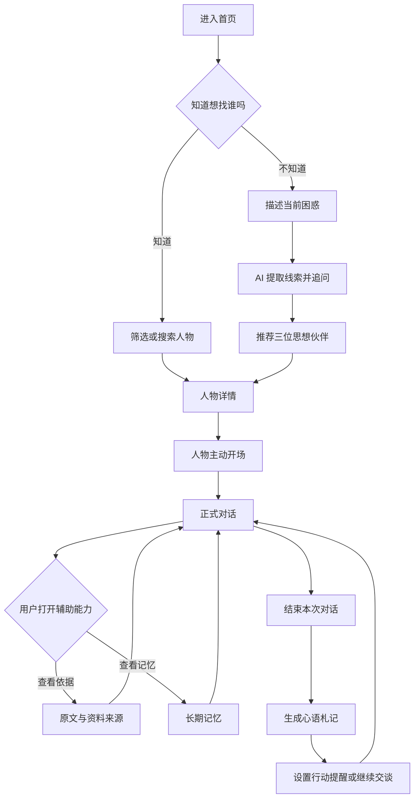
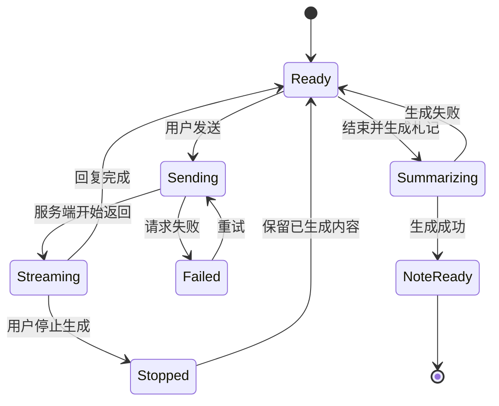
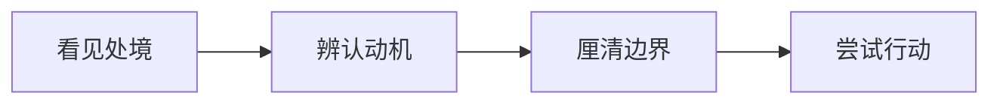
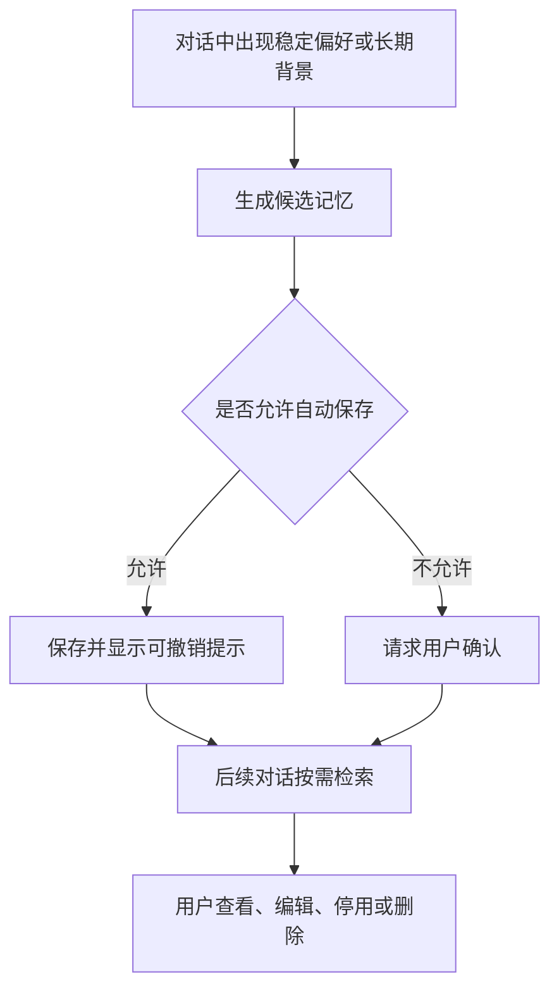

# 先贤心语交互流程与页面状态

## 核心用户闭环

## 页面关系

| 页面 | 推荐路由 | 进入方式 | 主要退出方式 |
| --- | --- | --- | --- |
| 人物发现首页 | `/` | 直接访问 | 人物详情、思想路径、札记 |
| 思想路径 | `/paths` | 首页主入口、导航 | 推荐人物详情、返回发现 |
| 人物详情 | `/figures/:figureId` | 人物卡、推荐结果 | 新建对话、查看资料 |
| 正式对话 | `/chat/:conversationId` | 人物主动开场 | 生成札记、返回人物 |
| 心语札记列表 | `/notes` | 顶部导航、结束对话 | 札记详情、继续对话 |
| 心语札记详情 | `/notes/:noteId` | 札记列表 | 编辑、导出、继续对话 |
| 记忆管理 | `/settings/memory` 或聊天抽屉 | 聊天和札记 | 删除、停用、返回聊天 |
| 资料来源 | 抽屉或 `/sources/:sourceId` | 消息引用、人物详情 | 收起、返回原消息 |

## 首页状态

| 状态 | 表现 | 用户操作 |
| --- | --- | --- |
| 默认 | 推荐人物、主题入口、当前困惑输入框 | 浏览、搜索、选择标签 |
| 已筛选 | 结果数量、可移除筛选标签、清空筛选 | 组合时代/领域/话题/困惑 |
| 搜索中 | 输入框右侧轻量进度、卡牌骨架屏 | 继续输入或取消 |
| 无结果 | 文案“暂时没有完全符合的思想伙伴” | 放宽筛选或进入思想路径 |
| 加载失败 | 保留筛选条件，展示重试按钮 | 重试 |

## 思想路径状态

1. 用户输入或语音描述困惑。
2. AI 抽取 2～4 个线索，用户可以删除或补充。
3. AI 每次只追问一个关键问题，不连续展示长表单。
4. 用户选择快捷回答或自由输入。
5. 系统给出 3 位人物，并解释每位人物会从哪个角度切入。
6. 用户可以选择人物、比较谈话方式或跳过推荐浏览全部人物。

异常状态：

- 输入少于 4 个有效汉字：提示“再多说一点发生了什么”。
- AI 提取失败：保留原输入，允许用户直接选主题。
- 推荐失败：展示固定编辑推荐，不阻断后续。
- 敏感危机表达：停止角色化挑战，显示明确的现实求助提示和紧急资源入口；不得把先贤人格包装为专业治疗。

## 人物详情状态

- 默认展示人物简介、适聊问题、谈话风格、核心思想和资料来源。
- 点击“让孔子先开口”后先创建会话，再进入聊天页。
- 创建期间按钮文案改为“正在准备这次谈话…”，禁止重复点击。
- 创建失败时原位提示“没有准备好，再试一次”，保留用户选择。
- 点击“查看思想与资料来源”打开右侧抽屉，桌面宽 420px，移动端使用底部 Sheet。

## 对话状态机

对话中的思想路径：

阶段不是固定轮数。模型每次回复附带 `stage`，前端只展示服务端返回的可信枚举值。

## 资料引用流程

1. AI 回复中引用内容显示来源 Chip。
2. 点击 Chip 展开本消息下方的简要解释。
3. 点击“查看原文与解释”打开资料抽屉。
4. 抽屉必须展示作品名、章节、原文/译文、解释、来源链接、资料类型和检索日期。
5. 明确区分“人物原句”“后世概括”“AI 基于资料的模拟表达”。
6. 引用加载失败不影响聊天正文，显示“暂时无法载入来源”与重试按钮。

## 长期记忆流程

记忆不保存临时情绪判断，不保存模型推断出的敏感身份，不允许人物自行编造用户经历。删除后立即从前端消失，并调用后端永久删除接口。

## 心语札记流程

- 用户主动结束或达到合适阶段后，可生成札记。
- 札记结构固定为：本次困惑、处境、可能根源、新理解、人物原话/模拟表达、资料依据、下一步行动、用户补充。
- 自动生成内容均可编辑。
- 自动保存使用 800ms 防抖；保存失败显示本地草稿状态，恢复网络后重试。
- 用户可以继续交谈、设置提醒、导出 Markdown/PDF 或删除札记。

## 移动端关键差异

- 聊天时隐藏全局底部导航，避免与输入法和输入框竞争。
- 桌面左侧历史列表通过返回页访问。
- 桌面右侧思考线索变成顶部横向步骤条。
- 资料来源使用底部 Sheet；输入框保持 `position: sticky/fixed` 并处理安全区。
- 快捷回答横向滚动，不强行换成多行小按钮。

